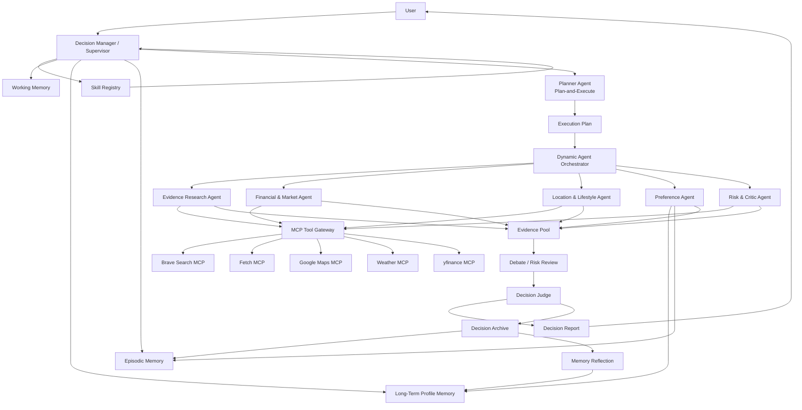
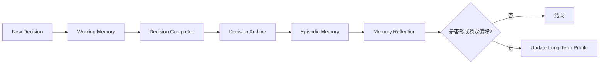
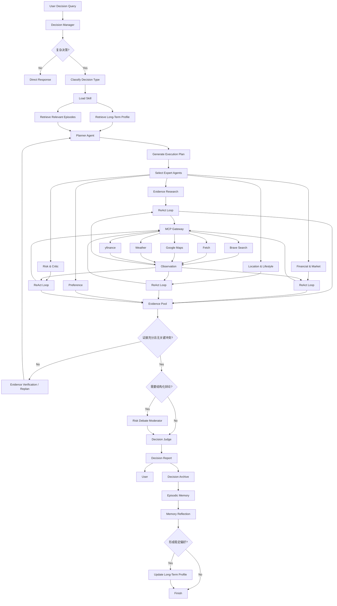

# Personal Decision Agent：个人复杂决策多智能体系统需求与架构

## 1. 项目定位

**Personal Decision Agent** 是一个面向个人复杂决策场景的多智能体决策系统。

系统接收用户提出的开放式复杂决策问题，结合当前任务信息、历史决策记录、长期个人偏好以及实时外部数据，自动完成需求解析、任务规划、专家 Agent 动态编排、外部证据检索、多角度分析、风险质疑、结构化辩论、综合判断和决策归档。

系统主要处理存在多个候选方案、多个评价维度、信息不完备、需要实时外部信息或需要结合个人历史偏好的决策问题，例如：

- 是否接受某个工作 Offer。
- 多个工作 Offer 应如何选择。
- 是否购买某个产品。
- 两台（或若干）电脑、手机、汽车或其他商品哪个更适合。
- 某个课程、培训、会员或订阅是否值得购买。
- 多个旅行目的地哪个更适合当前情况。
- 是否搬到另一个城市。
- 某个酒店、居住区域或生活方案是否适合。
- 当前个人投资组合是否需要调整。
- 某项重大消费或长期投入是否值得进行。
- 对过去做出的重要决定进行复盘。

系统不是单一领域推荐系统，而是通过统一的复杂决策框架处理多个个人决策领域。

---

## 2. 核心目标

### 2.1 多智能体协作

系统由编排层 Agent 和执行专家 Agent 组成。

编排层负责：

- 判断任务是否属于复杂决策。
- 加载适用的 Skill。
- 制定宏观执行计划。
- 根据决策类型动态选择专家 Agent。
- 管理 Agent 执行顺序与依赖关系。
- 汇总多 Agent 输出。
- 触发补充调查、重新规划或结构化辩论。
- 生成最终决策结论。

执行专家负责：

- 调查外部事实。
- 获取实时数据。
- 读取个人偏好。
- 从特定专业角度分析候选方案。
- 对已有观点进行反驳、验证和风险检查。

---

### 2.2 Plan-and-Execute

复杂决策任务采用 **Plan-and-Execute** 作为宏观执行范式。

Planner Agent 根据用户问题、Skill 定义、Memory 和当前可用 MCP Tools 生成结构化计划。

计划需要包含：

- 决策目标。
- 候选方案。
- 已知条件。
- 缺失信息。
- 硬约束。
- 软偏好。
- 需要调查的外部事实。
- 需要激活的专家 Agent。
- 每个任务的输入和预期输出。
- 任务之间的依赖关系。
- 完成条件。
- 是否需要辩论。
- 是否需要二次验证。

Executor 按计划执行各节点，并根据实际执行结果更新任务状态。

当出现以下情况时允许重新规划：

- 核心信息缺失。
- 外部证据彼此矛盾。
- 某个候选方案违反硬约束。
- 专家 Agent 结论高度冲突。
- Critic Agent 发现关键遗漏。
- 原计划中的某个步骤失效。
- 新获取的信息改变决策空间。

---

### 2.3 ReAct

执行专家 Agent 内部采用 **ReAct** 范式完成具体子任务。

基本循环：

```text
Reason
  ↓
选择 Tool
  ↓
MCP Tool Call
  ↓
Observation
  ↓
判断当前信息是否足够
  ├── 否 → 继续 Reason / Tool Call（最多三次，否则输出相应信息）
  └── 是 → 输出 Expert Result
```

单个专家 Agent 可以根据 Observation：

- 修改检索关键词。
- 调用不同 MCP Tool。
- 查找第二来源。
- 淘汰不满足条件的候选项。
- 请求补充信息。
- 标记证据冲突。
- 降低某项证据可信度。
- 提前结束无必要的调查。

Plan-and-Execute 负责宏观任务分解，ReAct 负责子任务内部的动态工具调用与推理。

---

### 2.4 多级个人记忆

系统采用 **Working Memory、Episodic Memory、Long-Term Profile Memory** 三级个人记忆结构，并额外维护 **Decision Archive** 保存完整决策记录。所有记忆的读取、写入、检索和更新统一通过 **Memory Manager** 管理，Agent 不直接操作底层存储。

整体结构如下：

```text
                     User Query
                         │
                         ▼
                  Memory Manager
                         │
          ┌──────────────┼──────────────┐
          ▼              ▼              ▼
   Working Memory   Episodic Memory   Profile Memory
      当前任务         历史事件          稳定偏好
          │              │              │
          └──────────────┼──────────────┘
                         ▼
                 Context for Agents
                         │
                         ▼
                   Decision Process
                         │
                         ▼
                  Decision Archive
                         │
                         ▼
                 Memory Extraction
                         │
                         ▼
                 Memory Reflection
                    │          │
                    ▼          ▼
              Episodic      Profile Update
```

#### 2.4.1 Memory Manager

Memory Manager 是整个记忆系统的统一访问入口，负责：

* 创建和更新 Working Memory；
* 检索与当前决策相关的 Episodic Memory；
* 获取相关 Long-Term Profile；
* 保存完整 Decision Archive；
* 在一次决策结束后触发记忆提取；
* 对候选长期记忆进行验证和更新；
* 控制记忆的生命周期和写入权限。

各 Agent 不直接操作数据库，而是通过统一接口访问记忆，例如：

```python
memory.get_working_memory(...)
memory.retrieve_episodes(...)
memory.get_profile(...)
memory.write_episode(...)
memory.update_profile(...)
memory.save_decision_archive(...)
```

Memory Manager 主要负责工程层面的“存什么、读什么、更新什么”，而 Preference Agent 负责根据取回的记忆判断“这些信息对当前决策意味着什么”。

---

#### 2.4.2 Working Memory

Working Memory 保存**当前一次决策正在发生的状态**，生命周期通常仅覆盖单次决策任务。

主要包含：

* 用户当前问题；
* 决策类型；
* 候选方案；
* 硬约束；
* 当前软偏好；
* Planner 生成的执行计划；
* 已完成和待完成任务；
* 当前 Agent 状态；
* MCP Tool Observation；
* Evidence ID；
* 中间分析结果；
* 当前争议点；
* Replan 状态。

例如：

```json
{
  "decision_id": "D001",
  "query": "是否接受杭州A公司Offer",
  "decision_type": "job_offer",
  "candidates": [
    "接受A公司Offer",
    "留在当前公司"
  ],
  "hard_constraints": [
    "薪资不能明显下降"
  ],
  "current_preferences": {
    "career_growth": 5,
    "salary": 4,
    "stability": 4
  },
  "completed_tasks": [
    "company_research"
  ],
  "pending_tasks": [
    "location_analysis",
    "risk_review"
  ],
  "evidence_ids": [
    "EV001",
    "EV002"
  ],
  "current_status": "EXECUTING"
}
```

在 LangGraph 中，Working Memory 可以直接对应整个 `DecisionState`：

```text
Planner
  ↓
更新 Plan

Expert Agent
  ↓
更新 Task Result / Evidence

Critic Agent
  ↓
更新 Risk Result

Judge
  ↓
更新 Final Decision
```

任务结束后，对 Working Memory 中的重要内容进行摘要并写入 Decision Archive 和 Episodic Memory，临时状态随后可以清理或归档。

---

#### 2.4.3 Episodic Memory

Episodic Memory 保存**过去发生过的重要决策事件**，用于回答：

> 过去在类似情况下发生过什么？

Episodic Memory 不直接保存全部历史聊天，而是保存经过压缩后的结构化决策事件。

例如：

```json
{
  "episode_id": "EP027",
  "date": "2026-08-18",
  "decision_type": "job_offer",
  "situation": "上海18k与杭州25k AI Agent岗位之间选择",
  "options": [
    "上海当前岗位",
    "杭州A公司"
  ],
  "recommendation": "杭州A公司",
  "user_choice": "杭州A公司",
  "key_reasons": [
    "更符合长期Agent开发方向",
    "薪资提升明显"
  ],
  "risks": [
    "创业公司稳定性",
    "需要搬家"
  ],
  "user_feedback": null,
  "tags": [
    "career",
    "job_offer",
    "agent",
    "hangzhou"
  ]
}
```

当之后再次出现类似问题，例如：

> “现在又有两个 Offer，哪个更适合？”

Memory Manager 可以优先检索历史 `job_offer` 类型 Episode，而不是重新加载所有历史对话。

Episodic Memory 的检索可以采用：

```text
Metadata Filter
+
Semantic Similarity
```

例如先通过：

```text
decision_type = job_offer
```

筛选历史事件，再使用 Embedding 检索与当前问题最相似的若干 Episode。

最终只向 Agent 提供 Top-K 相关事件，例如：

```text
EP027
EP018
EP012
```

从而避免上下文随长期使用无限增长。

---

#### 2.4.4 Long-Term Profile Memory

Long-Term Profile Memory 保存**从多次历史决策中逐渐形成的稳定个人偏好、价值排序和决策模式**，用于回答：

> 这个人在长期决策中通常是什么样的？

例如：

```json
{
  "career": {
    "career_growth": {
      "value": "high",
      "importance": 5,
      "confidence": 0.91,
      "supporting_episodes": [
        "EP018",
        "EP027",
        "EP031"
      ]
    },
    "stability": {
      "value": "medium_high",
      "importance": 4,
      "confidence": 0.78,
      "supporting_episodes": [
        "EP027",
        "EP029"
      ]
    },
    "preferred_direction": {
      "value": "AI Agent Development",
      "confidence": 0.94
    }
  },
  "consumption": {
    "noise_sensitivity": {
      "value": "high",
      "confidence": 0.87
    }
  },
  "risk": {
    "risk_tolerance": {
      "value": "medium",
      "confidence": 0.72
    }
  }
}
```

Long-Term Profile 与 Episodic Memory 的区别为：

```text
Episodic Memory
“过去发生过什么？”

Long-Term Profile
“这些历史事件共同说明了什么？”
```

例如：

```text
EP03：购买电脑时优先选择静音型号
EP11：拒绝高性能但高噪声设备
EP19：再次明确表示讨厌风扇噪声
            ↓
Memory Reflection
            ↓
Profile：
noise_sensitivity = high
confidence = 0.90
```

长期 Profile 不应因为一次临时表达立即发生大幅改变。

---

#### 2.4.5 Decision Archive

Decision Archive 保存一次复杂决策的**完整结构化记录**。

包括：

* 用户原始问题；
* 候选方案；
* 硬约束；
* 偏好；
* Execution Plan；
* 外部 Evidence；
* 各 Expert Agent 结论；
* Critic 分析；
* Debate 结果；
* 最终建议；
* 置信度；
* 主要理由；
* 风险；
* 不确定信息；
* 用户最终选择；
* 后续真实结果。

例如：

```yaml
decision_id: D031
decision_type: job_offer

question:
  是否接受杭州A公司的Offer

recommendation:
  接受

confidence:
  0.82

key_reasons:
  - 技术方向匹配
  - 薪资提升明显
  - 符合长期职业目标

major_risks:
  - 创业公司稳定性
  - 需要搬家

user_final_choice:
  接受

follow_up_result:
  null
```

Decision Archive 与 Episodic Memory 的关系为：

```text
完整 Decision Archive
        ↓
Memory Extractor
        ↓
精简 Episodic Memory
```

Decision Archive 负责保存完整信息，Episodic Memory 负责保存未来 Agent 最值得记住的摘要。

---

#### 2.4.6 记忆提取

自然语言中的记忆内容通过 LLM 进行结构化提取，但 LLM 不直接决定所有长期记忆的最终写入。

基本原则为：

> **LLM 负责提取候选记忆，Memory Manager 负责决定是否存储、存在哪一层以及如何更新。**

一次决策结束后：

```text
Conversation / Decision Result
              ↓
       Decision Archive
              ↓
       LLM Memory Extractor
              ↓
     Structured Memory Candidate
```

LLM 可以输出统一的结构化结果：

```json
{
  "episode_summary": "用户在上海18k与杭州25k AI Agent岗位之间进行选择，并更偏向长期技术成长。",
  "key_reasons": [
    "Agent岗位更符合长期职业目标",
    "薪资提升明显"
  ],
  "accepted_risks": [
    "创业公司稳定性",
    "需要搬家"
  ],
  "explicit_preferences": [
    {
      "key": "preferred_direction",
      "value": "AI Agent Development",
      "strength": 0.95
    }
  ],
  "inferred_preferences": [
    {
      "key": "career_growth",
      "value": "high",
      "strength": 0.80,
      "evidence": "用户在薪资、稳定性和成长空间之间明显优先考虑职业成长"
    }
  ]
}
```

记忆提取可以区分两类偏好：

##### Explicit Preference

用户明确表达的偏好，例如：

> “以后买电脑我一直都非常在意噪声。”

这类记忆可信度较高。

##### Inferred Preference

从用户行为或多次决策中推断出的偏好，例如：

> 用户连续三次选择技术成长更高但稳定性稍低的岗位。

这类记忆不能因为一次行为就直接写入长期 Profile，需要更多历史证据。

---

#### 2.4.7 Memory Reflection 与长期记忆更新

所有候选长期记忆进入 Memory Reflection 流程。

```text
New Episode
    │
    ▼
Candidate Preference
    │
    ▼
Memory Reflection
    │
    ├── 是否是临时需求？
    ├── 是否为明确长期偏好？
    ├── 是否已有类似 Profile？
    ├── 是否得到多个 Episode 支持？
    ├── 是否与旧 Profile 冲突？
    └── 用户是否明确表示偏好发生变化？
           │
           ▼
     Profile Update Policy
```

长期 Profile 更新可以采用以下规则：

```text
用户明确声明长期偏好
→ 可以直接写入 Profile，并给予较高 confidence

单次行为推断
→ 仅保存到 Episode，不直接写入 Profile

多个独立 Episode 一致支持
→ 新建或强化 Profile

新证据与旧 Profile 冲突
→ 降低 confidence，而不是立即覆盖

用户明确表示“偏好已经改变”
→ 允许更新原有 Profile
```

例如：

```text
第一次：
用户为了技术成长选择新岗位

→ 保存 Episode
→ career_growth confidence = 0.55
```

第二次出现相同行为：

```text
→ confidence = 0.70
```

第三次再次出现：

```text
→ confidence = 0.85
```

每条长期记忆保存 confidence 和证据来源：

```json
{
  "key": "career_growth",
  "value": "very_important",
  "confidence": 0.85,
  "source_count": 3,
  "supporting_episodes": [
    "EP018",
    "EP027",
    "EP031"
  ],
  "last_updated": "2026-08-18"
}
```

---

#### 2.4.8 记忆写入流程

一次决策结束后的完整写入流程如下：

```text
Decision 完成
       │
       ▼
保存完整 Decision Archive
       │
       ▼
LLM Memory Extractor
       │
       ▼
生成 Episodic Memory
       │
       ├─────────────────────────┐
       ▼                         ▼
直接保存 Episode          Candidate Preferences
                                 │
                                 ▼
                         Memory Reflection
                                 │
                    ┌────────────┼────────────┐
                    ▼            ▼            ▼
                 Support      Conflict     Temporary
                    │            │            │
                    ▼            ▼            ▼
               强化 Profile   降低置信度    不更新 Profile
```

Memory Extraction 负责自然语言理解，Memory Manager 和规则系统负责记忆生命周期管理。

---

#### 2.4.9 记忆读取流程

新的复杂决策到来时，不读取全部历史记忆，而是根据当前任务进行针对性检索。

例如用户提出：

> “这两份 Offer 哪个更适合？”

Memory Manager 首先确定：

```text
decision_type = job_offer
```

然后分别读取：

```text
Working Memory
→ 当前两份 Offer 的信息

Episodic Memory
→ 历史 job_offer / career Episode
→ Top-K 相似事件

Long-Term Profile
→ career / risk / location 相关偏好
```

最终组成：

```json
{
  "current_context": {},
  "relevant_history": [],
  "stable_preferences": {}
}
```

并交给 Preference Agent。

Preference Agent 在此基础上判断本次决策中的个人权重，例如：

```text
技术成长：★★★★★
工作稳定性：★★★★
薪资：★★★★
城市偏好：★★★
```

---

#### 2.4.10 Memory Manager 与 Preference Agent 的职责划分

Memory Manager 是确定性的工程组件，负责：

```text
存什么
读什么
检索什么
更新什么
```

Preference Agent 是基于 LLM 的分析 Agent，负责：

```text
这些记忆对本次决策意味着什么
```

例如 Memory Manager 返回：

```text
career_growth = 5
stability = 4
city = 3

Relevant Episodes:
EP12
EP19
EP27
```

Preference Agent 输出：

```text
本次 Offer 决策中，
技术成长属于最高优先级，
稳定性次之，
城市变化不是硬约束。
```

---

#### 2.4.11 技术实现

V1 采用轻量实现：

| 记忆组件               | 实现                                  |
| ------------------ | ----------------------------------- |
| Working Memory     | LangGraph State                     |
| Working Memory 持久化 | LangGraph SQLite Checkpointer       |
| Decision Archive   | SQLite                              |
| Episodic Memory    | SQLite                              |
| Long-Term Profile  | SQLite                              |
| Episode Embedding  | Embedding Model                     |
| 相似 Episode 检索      | Metadata Filter + Vector Similarity |
| Memory Extraction  | LLM Structured Output               |
| Memory Reflection  | LLM + Rule-based Policy             |
| 统一访问               | Memory Manager                      |

核心数据库可以包含：

```text
decision_archive
episodes
profile_memories
```

`profile_memories` 可使用如下结构：

```text
id
category
key
value
importance
confidence
source_episode_ids
created_at
last_updated
```

代码模块：

```text
memory/
├── manager.py
├── working.py
├── episodic.py
├── profile.py
├── archive.py
├── retrieval.py
├── extractor.py
└── reflection.py
```

对应职责：

```text
manager.py
统一记忆访问入口

working.py
Working Memory / LangGraph State

episodic.py
历史 Episode 存储与读取

profile.py
Long-Term Profile 管理

archive.py
完整 Decision Archive

retrieval.py
相关 Episode 和 Profile 检索

extractor.py
LLM 结构化记忆提取

reflection.py
候选长期记忆验证与 Profile 更新
```

---

#### 2.4.12 多级记忆闭环

完整的个人记忆演化过程为：

```text
当前正在发生什么
        ↓
 Working Memory
        ↓
一次完整决策完成
        ↓
 Decision Archive
        ↓
LLM 提取重要事件
        ↓
 Episodic Memory
        ↓
多个历史事件积累
        ↓
 Memory Reflection
        ↓
提炼稳定个人特征
        ↓
Long-Term Profile Memory
        ↓
影响未来复杂决策
```

系统的长期记忆不是将全部聊天内容直接进行 Embedding 后存入向量数据库，而是通过：

> **当前状态 → 重要事件 → 稳定个人特征**

逐级抽象，从而形成能够持续支持复杂个人决策的结构化长期记忆系统。

---

### 2.5 MCP Tool Calling

外部数据能力统一通过 MCP 接入，MCP 来自[awesome-mcp-servers](https://github.com/punkpeye/awesome-mcp-servers/)，选择合适的服务。

Agent 不直接绑定第三方 API，不直接调用具体 SDK，而是通过统一 Tool Registry 获取 MCP Tool Schema 后执行工具调用。

系统需要支持：

- MCP Server 注册。
- Tool Schema 自动发现。
- MCP Tool 与内部能力名称映射。
- Tool 权限控制。
- Tool 调用日志。
- Tool 超时与错误处理。
- Tool Result 标准化。
- Agent 级 Tool 白名单。
- 多 MCP Server 可替换。

---

### 2.6 Skills

重复出现的复杂决策流程通过 Skills 固化。

Skill 描述：

- 适用场景。
- 输入要求。
- 推荐 Agent。
- 推荐 MCP Tools。
- 标准分析维度。
- 工作流。
- 输出 Schema。
- 风险检查规则。
- 完成条件。

Skill 不等同于单个 Prompt，而是可加载的决策 SOP。

---

## 3. 项目范围

### 3.1 V1 支持的决策类型

V1 支持以下五类核心场景：

1. 工作 Offer 评估。
2. 商品/重大消费比较。
3. 旅行目的地或生活地点比较。
4. 课程/订阅/长期投入评估。
5. 个人投资组合分析。

同时支持通用的 Pros/Cons 决策任务。

---

### 3.2 V1 不包含的能力

系统不提供以下能力：

- Agent 任意执行 Python 代码。
- Agent 执行 Shell 命令。
- Agent 控制本地终端。
- Agent 任意修改本地文件。
- Agent 自动安装软件。
- Agent 执行用户提供的未知代码。
- Agent 使用代码沙箱。
- Agent 自动完成金融交易。
- Agent 自动购买商品。
- Agent 自动接受 Offer。
- Agent 自动提交订单。
- Agent 自动执行不可逆现实世界操作。

系统以**信息获取、分析、规划、比较、验证、建议、记忆与复盘**为主要能力。

---

## 4. 总体系统架构

系统由六个核心层组成：

1. User Interface
2. Decision Orchestration Layer
3. Expert Agent Layer
4. Skill Layer
5. MCP Tool Layer
6. Memory Layer

### 4.1 总体架构图



---

## 5. Agent 角色设计

系统包含 **3 个编排角色 + 5 个执行专家 Agent**。

### 5.1 Decision Manager / Supervisor

#### 职责

- 接收用户请求。
- 判断是否属于复杂决策任务。
- 识别决策领域。
- 读取相关 Memory。
- 匹配并加载 Skill。
- 启动 Planner Agent。
- 管理整个工作流状态。
- 控制是否重新规划。
- 控制是否触发 Debate。
- 将最终结果交付用户。
- 在用户完成真实决策后启动 Memory Update。

#### 输入

```yaml
user_query:
conversation_context:
working_memory:
relevant_episodic_memory:
profile_memory:
available_skills:
available_mcp_capabilities:
```

#### 输出

```yaml
decision_type:
selected_skill:
task_context:
workflow_status:
```

---

### 5.2 Planner Agent

#### 范式

Plan-and-Execute。

#### 职责

将复杂决策转换为可执行计划，并动态选择本次任务需要的专家 Agent。

#### 输出 Schema

```yaml
decision_goal:
decision_type:
candidates:
hard_constraints:
soft_preferences:
known_facts:
missing_information:

tasks:
  - task_id:
    objective:
    assigned_agent:
    dependencies:
    required_capabilities:
    completion_condition:

debate_required:
risk_review_required:
replan_conditions:
```

#### 动态 Agent 选择示例

**电脑购买：**

```text
Evidence Research Agent
Preference Agent
Risk & Critic Agent
```

**工作 Offer：**

```text
Evidence Research Agent
Location & Lifestyle Agent
Preference Agent
Risk & Critic Agent
```

**投资组合：**

```text
Financial & Market Agent
Evidence Research Agent
Preference Agent
Risk & Critic Agent
```

**旅行目的地：**

```text
Evidence Research Agent
Location & Lifestyle Agent
Preference Agent
Risk & Critic Agent
```

并非每个任务都启动全部执行专家。

---

### 5.3 Decision Judge

#### 职责

- 接收所有专家结论。
- 接收 Evidence Pool。
- 接收 Critic 结论。
- 接收 Debate 结果。
- 将事实证据与用户个人偏好分开处理。
- 判断硬约束是否满足。
- 对不同候选方案进行多维比较。
- 处理专家之间的冲突。
- 标记不确定信息。
- 形成最终决策建议。

#### 输出

```yaml
recommended_option:
confidence:
key_reasons:
tradeoffs:
major_risks:
uncertainties:
rejected_options:
why_rejected:
evidence_summary:
personal_preference_match:
next_action:
```

---

## 6. 执行专家 Agent

### 6.1 Evidence Research Agent

#### 目标

负责通用外部信息调查和事实证据获取。

#### 典型任务

- 公司背景调查。
- 行业趋势调查。
- 工作评价搜索。
- 产品参数调查。
- 商品评价调查。
- 课程口碑调查。
- 酒店/目的地评价调查。
- 市场价格信息调查。
- 多来源交叉验证。

#### ReAct Tool

主要可调用：

- Brave Search MCP。
- Fetch MCP。

#### 输出

```yaml
question:
findings:
  - claim:
    evidence:
    source:
    freshness:
    confidence:
conflicts:
missing_evidence:
overall_confidence:
```

#### 规则

- 重要结论优先寻找多个独立来源。
- 搜索结果摘要不足以支持关键结论时继续读取原文。
- 区分事实、观点和推断。
- 对时间敏感信息记录获取时间。
- 证据冲突必须显式标记。

---

### 6.2 Financial & Market Agent

#### 目标

处理金融、市场和投资相关维度。

#### 典型任务

- 获取股票行情。
- 获取历史价格。
- 获取公司市场数据。
- 获取 ETF 数据。
- 获取公司基础金融信息。
- 分析投资组合集中度。
- 比较不同资产的风险暴露。
- 为投资组合决策提供市场层证据。

#### MCP

- `narumiruna/yfinance-mcp`
- Brave Search MCP
- Fetch MCP

#### 限制

仅允许读取金融数据和生成分析。

禁止：

```text
buy
sell
place_order
transfer
withdraw
```

---

### 6.3 Location & Lifestyle Agent

#### 目标

处理地理位置、通勤、生活便利度、旅行和天气等现实环境因素。

#### 典型任务

- 工作地点与居住地点距离。
- 搬家影响。
- 通勤距离与路线。
- 周边 POI。
- 旅行目的地比较。
- 天气差异。
- 城市生活条件。
- 酒店位置便利度。
- 活动区域规划。

#### MCP

- `@modelcontextprotocol/server-google-maps`
- `isdaniel/mcp_weather_server`
- Brave Search MCP
- Fetch MCP

#### 输出

```yaml
location_findings:
travel_time:
distance:
nearby_facilities:
weather_factors:
lifestyle_factors:
risks:
```

---

### 6.4 Preference Agent

#### 目标

负责从个人 Memory 中恢复和提炼与当前决策相关的个人偏好。

#### 数据来源

- Working Memory。
- Episodic Memory。
- Long-Term Profile Memory。
- Decision Archive。

#### 不直接调用外部 MCP

Preference Agent 处理的是个人内部信息，而不是外部现实数据。

#### 典型输出

```yaml
hard_personal_constraints:
preferences:
  - factor:
    importance:
    evidence_from_history:
historical_patterns:
past_related_decisions:
potential_preference_conflicts:
```

#### 示例

```text
职业成长：5/5
薪资：4/5
工作稳定性：4/5
Work-Life Balance：3/5
城市偏好：4/5
```

---

### 6.5 Risk & Critic Agent

#### 目标

对其他专家的结论进行对抗性检查。

#### 职责

- 查找被忽略的风险。
- 查找反例。
- 检查证据可靠性。
- 检查信息是否过期。
- 检查是否只依赖单一来源。
- 检查是否遗漏用户硬约束。
- 检查专家结论是否存在过度推断。
- 检查候选方案的 downside。
- 对主要推荐方案进行反方论证。

#### MCP

- Brave Search MCP。
- Fetch MCP。
- 必要时允许调用 Google Maps / Weather / yfinance。

#### 输出

```yaml
challenged_claims:
overlooked_risks:
evidence_quality_issues:
missing_dimensions:
counter_arguments:
critical_questions:
risk_level:
```

---

## 7. 专家 Agent 动态激活规则

### 7.1 Offer Decision

```text
Evidence Research Agent      必选
Preference Agent             必选
Risk & Critic Agent          必选
Location & Lifestyle Agent   条件激活
Financial & Market Agent     条件激活
```

Location Agent 激活条件：

- 涉及搬家。
- 涉及通勤变化。
- 涉及不同城市。
- 涉及远程/现场办公差异。

Financial Agent 激活条件：

- 涉及上市公司股票。
- 涉及 RSU。
- 涉及 Equity。
- 涉及明显的金融机会成本分析。

---

### 7.2 Product Comparison

```text
Evidence Research Agent      必选
Preference Agent             必选
Risk & Critic Agent          必选
Location & Lifestyle Agent   通常关闭
Financial & Market Agent     通常关闭
```

---

### 7.3 Travel / Location Decision

```text
Evidence Research Agent      必选
Location & Lifestyle Agent   必选
Preference Agent             必选
Risk & Critic Agent          必选
Financial & Market Agent     关闭
```

---

### 7.4 Portfolio Review

```text
Financial & Market Agent     必选
Evidence Research Agent      必选
Preference Agent             必选
Risk & Critic Agent          必选
Location & Lifestyle Agent   关闭
```

---

### 7.5 Course / Subscription Decision

```text
Evidence Research Agent      必选
Preference Agent             必选
Risk & Critic Agent          必选
Financial & Market Agent     通常关闭
Location & Lifestyle Agent   通常关闭
```

---

## 8. MCP Tool Layer

### 8.1 MCP Gateway

所有外部 Tool Call 通过 MCP Gateway 统一执行。

内部 Agent 不需要感知 MCP Server 的具体实现，只感知标准化能力，例如：

```text
web_search
fetch_page
search_place
get_route
get_weather
get_market_data
```

MCP Gateway 负责将能力映射到实际 MCP Server。

### 8.2 Tool Registry

示例：

```yaml
web_search:
  provider: brave-search
  permission: read_only

fetch_page:
  provider: fetch
  permission: read_only

place_search:
  provider: google-maps
  permission: read_only

route_search:
  provider: google-maps
  permission: read_only

weather_forecast:
  provider: weather
  permission: read_only

market_data:
  provider: yfinance
  permission: read_only
```

---

## 9. V1 核心 MCP Server

### 9.1 Brave Search MCP

**项目：**

```text
brave/brave-search-mcp-server
```

**内部能力映射：**

```text
web_search
news_search
local_search
place_search
```

**主要使用 Agent：**

- Evidence Research Agent。
- Risk & Critic Agent。
- Financial & Market Agent。
- Location & Lifestyle Agent。

**用途：**

- 搜索公司新闻。
- 搜索产品评价。
- 搜索课程评价。
- 搜索行业信息。
- 搜索薪酬相关公开信息。
- 搜索旅行信息。
- 搜索风险事件。
- 寻找反例和第二来源。

---

### 9.2 Fetch MCP

**项目：**

```text
modelcontextprotocol/server-fetch
```

**内部能力：**

```text
fetch_page(url)
```

**主要使用 Agent：**

- Evidence Research Agent。
- Risk & Critic Agent。
- Financial & Market Agent。

**用途：**

Brave Search 找到目标网页后进一步获取正文，并将网页内容转换为适合 LLM 使用的文本/Markdown。

典型 ReAct：

```text
Search
  ↓
得到 URL
  ↓
判断该来源值得进一步阅读
  ↓
Fetch
  ↓
提取正文
  ↓
形成 Evidence
```

---

### 9.3 Google Maps MCP

**项目：**

```text
@modelcontextprotocol/server-google-maps
```

**内部能力：**

```text
place_search
place_details
route_search
distance_analysis
```

**主要使用 Agent：**

- Location & Lifestyle Agent。

**用途：**

- 地点查询。
- 公司位置查询。
- 酒店/景点位置。
- 路线与通勤分析。
- 地点详情。
- 周边生活便利度辅助分析。

---

### 9.4 Weather MCP

**项目：**

```text
isdaniel/mcp_weather_server
```

**数据源：**

Open-Meteo API。

**内部能力：**

```text
current_weather
weather_forecast
air_quality
timezone
```

**主要使用 Agent：**

- Location & Lifestyle Agent。

**用途：**

- 旅行决策。
- 城市比较。
- 周末活动决策。
- 天气风险分析。

---

### 9.5 yfinance MCP

**项目：**

```text
narumiruna/yfinance-mcp
```

**内部能力：**

```text
ticker_info
price_history
market_info
financial_data
```

**主要使用 Agent：**

- Financial & Market Agent。

**用途：**

- 股票行情。
- 历史市场数据。
- 公司市场信息。
- ETF 数据。
- 个人投资组合相关研究。

---

## 10. MCP 权限规则

V1 所有 MCP Tool 默认采用 **Read-Only** 权限。

### 允许

```text
search
fetch
query
get
list
read
lookup
compare
```

### 禁止

```text
execute_code
shell
install
delete
write_local_file
send_money
place_order
buy
sell
book
purchase
submit
accept_offer
```

MCP Gateway 维护 Tool Permission Policy：

```yaml
tool:
permission:
allowed_agents:
timeout:
max_calls_per_task:
requires_confirmation:
```

---

## 11. 多级记忆系统

### 11.1 Level 1：Working Memory

生命周期：单次决策。

存储：

- 用户当前问题。
- 候选方案。
- 当前约束。
- 当前偏好。
- Execution Plan。
- Agent Task 状态。
- Tool Observation。
- 中间结论。
- Evidence Pool。
- 当前争议点。
- Replan 状态。

示例：

```yaml
decision_id: D20260818-001
goal: 是否接受 A 公司 Offer
candidates:
  - A公司
  - 保留当前工作
hard_constraints:
  - 月薪不能低于当前水平
current_step: 5
completed_tasks:
  - company_research
  - salary_research
pending_tasks:
  - location_analysis
evidence_count: 14
```

任务完成后 Working Memory 进行摘要，原始临时内容可清理。

---

### 11.2 Level 2：Episodic Memory

生命周期：长期。

存储“过去发生过什么”。

每条 Episode 包含：

```yaml
episode_id:
date:
decision_type:
decision_question:
options:
final_recommendation:
user_actual_choice:
key_reasons:
major_tradeoffs:
outcome:
user_feedback:
related_profile_signals:
```

示例：

```text
2026-08：
比较 A 和 B 两个工作 Offer。

Agent 推荐：
B。

用户实际选择：
B。

主要理由：
技术成长空间明显高于 A。

后续反馈：
选择正确。

可提炼偏好：
长期成长的重要性高于短期薪酬差异。
```

---

### 11.3 Level 3：Long-Term Profile Memory

存储从多次对话和历史决策中形成的稳定个人模型。

主要类别：

```yaml
career_preferences:
financial_risk_profile:
consumption_preferences:
travel_preferences:
location_preferences:
learning_preferences:
decision_style:
risk_tolerance:
recurring_constraints:
```

偏好项结构：

```yaml
preference:
value:
importance:
confidence:
supporting_episodes:
last_updated:
```

示例：

```yaml
preference: 技术成长
importance: 5
confidence: 0.91
supporting_episodes:
  - EP-018
  - EP-027
  - EP-031
```

Long-Term Profile 不因一次对话直接大幅改变。

只有当：

- 用户明确声明长期偏好；或
- 多个 Episodic Memory 提供一致证据；

才允许更新。

---

## 12. Decision Archive

Decision Archive 是历史复杂决策的结构化档案。

Schema：

```yaml
decision_id:
created_at:
decision_type:
question:

options:
constraints:
preferences:

evidence_summary:
expert_results:
debate_summary:

recommendation:
confidence:
reasons:
risks:
uncertainties:

user_final_choice:
follow_up_result:
retrospective:
```

Decision Archive 支持：

- 查看过去决策。
- 查询类似历史问题。
- 比较过去与当前偏好。
- 对历史决策进行复盘。
- 为 Episodic Memory 提供数据来源。
- 为 Long-Term Profile Reflection 提供依据。

---

## 13. Memory 更新流程



---

## 14. Skills 系统

### 14.1 Skill 文件结构

每个 Skill 以独立目录或 Markdown/YAML 文件存在。

示例目录：

```text
skills/
├── job_offer_evaluator/
│   └── SKILL.md
├── product_comparison/
│   └── SKILL.md
├── travel_destination_compare/
│   └── SKILL.md
├── portfolio_review/
│   └── SKILL.md
├── course_subscription_evaluator/
│   └── SKILL.md
├── risk_debate_moderator/
│   └── SKILL.md
├── evidence_verification/
│   └── SKILL.md
└── decision_retrospective/
    └── SKILL.md
```

---

### 14.2 Skill 标准定义

```yaml
name:
description:
trigger_conditions:

required_inputs:
optional_inputs:

recommended_agents:
recommended_tools:

analysis_dimensions:

workflow:

risk_checks:

completion_conditions:

output_schema:
```

---

## 15. 核心 Skills

### 15.1 `job_offer_evaluator`

分析维度：

- 薪资。
- 总包。
- 工作内容。
- 技术成长。
- 公司状况。
- 行业前景。
- 稳定性。
- 工作强度。
- 通勤/搬家。
- 城市偏好。
- 长期职业目标。
- 机会成本。
- 风险。

推荐 Agent：

```text
Evidence Research Agent
Preference Agent
Risk & Critic Agent
Location & Lifestyle Agent（按需）
Financial & Market Agent（按需）
```

---

### 15.2 `product_comparison`

分析维度：

- 预算。
- 硬件/功能。
- 用户核心用途。
- 产品缺点。
- 长期使用成本。
- 评价一致性。
- 个人偏好匹配程度。

---

### 15.3 `travel_destination_compare`

分析维度：

- 时间。
- 天气。
- 距离。
- 交通。
- 预算。
- 景点。
- 餐饮。
- 行程强度。
- 历史旅行偏好。

---

### 15.4 `portfolio_review`

分析维度：

- 资产构成。
- 集中度。
- 行业暴露。
- 个股风险。
- 风险偏好。
- 投资期限。
- 流动性需求。
- 当前市场信息。

仅生成研究和建议，不执行交易。

---

### 15.5 `course_subscription_evaluator`

分析维度：

- 价格。
- 内容质量。
- 用户当前基础。
- 与目标的相关性。
- 替代方案。
- 时间成本。
- 历史学习偏好。
- 实际使用概率。

---

### 15.6 `risk_debate_moderator`

用于组织多 Agent 结构化辩论。

流程：

```text
收集当前推荐
   ↓
识别争议最大的 2~4 个维度
   ↓
Pro / Advocate 形成支持观点
   ↓
Con / Critic 形成反对观点
   ↓
双方必须引用 Evidence Pool
   ↓
互相质疑
   ↓
Moderator 提取共识
   ↓
提取未解决分歧
   ↓
提交 Decision Judge
```

输出：

```yaml
agreements:
disagreements:
strongest_pro_argument:
strongest_con_argument:
unresolved_risks:
evidence_quality:
```

---

### 15.7 `evidence_verification`

触发条件：

- 重要结论只有一个来源。
- 不同 Agent 给出冲突事实。
- 信息时间敏感。
- Critic Agent 质疑证据。
- Decision Judge 判断某项证据对最终结果权重过高。

流程：

```text
Claim
 ↓
获取原始 Source
 ↓
寻找独立第二来源
 ↓
比较时间
 ↓
比较定义和上下文
 ↓
标记 Confirmed / Conflicted / Weak
```

---

### 15.8 `decision_retrospective`

用于复盘历史 Decision Archive。

输入：

```text
原决策
原证据
原推荐
用户实际选择
一段时间后的真实结果
```

输出：

```yaml
what_was_correct:
what_was_wrong:
missing_information:
wrong_assumptions:
preference_updates:
future_decision_lessons:
```

复盘结果进入 Episodic Memory，并可能触发 Long-Term Profile 更新。

---

## 16. Evidence Pool

所有外部 Agent 产生的事实证据统一进入 Evidence Pool，而不是直接把自然语言结果传给 Judge。

Evidence Schema：

```yaml
evidence_id:
claim:
value:
source:
source_type:
retrieved_at:
agent:
tool:
confidence:
freshness:
supports_option:
contradicts_option:
status:
```

`status`：

```text
confirmed
single_source
conflicted
weak
outdated
```

Evidence Pool 用于：

- 专家共享证据。
- 避免重复查询。
- Critic 检查。
- Debate 引用。
- Judge 综合判断。
- 最终结果可解释性。

---

## 17. 一次完整工作流示例：是否接受工作 Offer

### 17.1 用户输入

```text
目前在上海工作，月薪 18k。
收到一家杭州 AI 创业公司的 Offer，月薪 25k。
岗位方向更符合未来想做的 Agent 开发，但需要搬到杭州。
应该接受吗？
```

---

### 17.2 Decision Manager

识别：

```yaml
decision_type: job_offer
skill: job_offer_evaluator
complexity: high
```

读取：

- 相关职业 Long-Term Profile。
- 历史 Offer Decision。
- 当前 Working Memory。

---

### 17.3 Preference Agent

输出：

```yaml
career_growth:
  importance: 5

salary:
  importance: 4

stability:
  importance: 4

city:
  importance: 3

agent_development_interest:
  importance: 5
```

同时返回与过去 Offer 决策相关的 Episode。

---

### 17.4 Planner Agent

生成：

```text
Task 1：调查目标公司
→ Evidence Research Agent

Task 2：调查 AI Agent 岗位和公司行业状态
→ Evidence Research Agent

Task 3：分析搬家和生活影响
→ Location & Lifestyle Agent

Task 4：恢复个人职业偏好
→ Preference Agent

Task 5：检查公司和 Offer 风险
→ Risk & Critic Agent

Task 6：结构化辩论
→ risk_debate_moderator

Task 7：综合决策
→ Decision Judge
```

Financial Agent 默认不激活。

如果 Offer 含大量 RSU/期权，再动态加入 Financial & Market Agent。

---

### 17.5 Evidence Research Agent：ReAct

```text
Reason:
需要确认公司基本情况和近期发展。

Action:
Brave Search MCP

Observation:
得到公司官网、融资新闻、媒体报道和招聘信息。

Reason:
融资状态可能对创业公司稳定性影响较大，需要阅读原始报道。

Action:
Fetch MCP

Observation:
获取融资报道正文。

Reason:
还缺少第三方或员工视角。

Action:
Brave Search MCP

Observation:
获得员工评价和其他讨论。

Reason:
信息已经覆盖公司、融资、岗位和外部评价。

Result:
输出 Evidence Bundle。
```

---

### 17.6 Location & Lifestyle Agent：ReAct

```text
Reason:
需要评估搬到杭州的实际影响。

Action:
Google Maps MCP

Observation:
获取公司位置。

Action:
Google Maps MCP

Observation:
获取附近住宅区域、交通及通勤路线。

Reason:
生活地点比较还需要天气和环境因素。

Action:
Weather MCP

Observation:
获得目标时间段相关天气信息。

Result:
形成 Location & Lifestyle Result。
```

---

### 17.7 Risk & Critic Agent

接收：

- Evidence Research Result。
- Location Result。
- Preference Result。

检查：

```text
公司融资是否只是历史信息？
员工评价是否样本偏差？
25k 是否忽略奖金和福利差异？
创业公司稳定性是否被低估？
搬家成本是否纳入？
岗位名称是否等同于真实工作内容？
技术成长判断是否存在宣传偏差？
```

如发现关键证据不足：

```text
Critic
  ↓
evidence_verification
  ↓
Search / Fetch
  ↓
Evidence Pool Update
```

---

### 17.8 Debate

`risk_debate_moderator` 组织：

**Pro：**

```text
薪资提升明显
岗位方向匹配长期目标
技术成长潜力高
```

**Con：**

```text
创业公司稳定性风险
搬家成本
实际工作强度未知
岗位真实职责存在不确定性
```

双方观点必须引用 Evidence Pool。

---

### 17.9 Decision Judge

综合：

```text
External Evidence
+
Personal Preferences
+
Hard Constraints
+
Expert Analysis
+
Critic Result
+
Debate Result
```

形成：

```yaml
recommendation: 倾向接受
confidence: 0.78

key_reasons:
  - Agent开发方向与长期职业目标高度匹配
  - 薪资提升明显
  - 搬家本身不违反核心个人约束

major_risks:
  - 创业公司稳定性
  - 实际工作强度仍存在不确定性

before_accepting:
  - 确认试用期与裁员补偿
  - 确认岗位实际职责
  - 确认奖金与社保公积金基数
```

---

### 17.10 Decision Archive

保存本次完整决策。

如果用户最终回答：

```text
接受了这个 Offer。
```

则更新：

```text
Decision Archive
↓
Episodic Memory
```

数月后可调用：

```text
decision_retrospective
```

分析实际结果，并更新长期职业偏好。

---

## 18. 完整执行流程图



---

## 19. 状态机

核心 Decision State：

```yaml
RECEIVED
CLASSIFIED
MEMORY_RETRIEVED
SKILL_LOADED
PLANNED
EXECUTING
VERIFYING
REPLANNING
DEBATING
JUDGING
COMPLETED
ARCHIVED
```

状态变化示例：

```text
RECEIVED
→ CLASSIFIED
→ MEMORY_RETRIEVED
→ SKILL_LOADED
→ PLANNED
→ EXECUTING
→ VERIFYING
→ DEBATING
→ JUDGING
→ COMPLETED
→ ARCHIVED
```

---

## 20. Agent 间通信规范

Agent 不共享无限完整上下文。

通过结构化对象通信：

```yaml
Task:
  task_id:
  objective:
  context:
  constraints:
  allowed_tools:
  expected_output:

AgentResult:
  task_id:
  findings:
  evidence_ids:
  uncertainties:
  risks:
  completion_status:
  follow_up_needed:
```

共享内容：

- Task。
- Evidence ID。
- 必要 Memory。
- Structured Result。

不共享：

- 所有历史对话全文。
- 所有其他 Agent 的完整中间推理。
- 与当前任务无关的长期记忆。

---

## 21. Tool 调用规范

每次 MCP Tool Call 记录：

```yaml
call_id:
decision_id:
task_id:
agent:
tool:
arguments:
timestamp:
status:
latency:
result_summary:
error:
```

Tool Result 经过 Adapter 标准化后再交给 Agent。

错误处理：

```text
Tool Timeout
→ retry

Tool Error
→ alternative tool / replan

Empty Result
→ modify query

Conflicting Result
→ evidence_verification

Repeated Failure
→ mark unavailable
→ continue with uncertainty
```

---

## 22. Human-in-the-Loop

以下情况需要用户补充或确认：

- 缺少关键硬约束。
- 两个方案的核心信息无法从公开渠道获取。
- 用户偏好之间发生明显冲突。
- 最终推荐高度依赖无法验证的事实。
- 决策涉及高风险金融问题。
- 系统尝试调用未来新增的写入型或现实行动型 Tool。

Human-in-the-Loop 不要求用户确认每一次普通搜索或读取型 MCP Tool Call。

---

## 23. 最终 Decision Report

最终响应采用统一结构：

```markdown
# 决策结论

## 推荐方案

## 置信度

## 最关键的三个理由

## 候选方案比较

## 与个人偏好的匹配

## 主要风险

## 当前仍存在的不确定信息

## 反方最强观点

## 最终判断依据

## 决策前还需要确认的事项
```

复杂决策必须显式区分：

- 已确认事实。
- 外部观点。
- Agent 推断。
- 用户历史偏好。
- 未验证信息。

---

## 24. 推荐实现结构

```text
personal-decision-agent/
│
├── app/
│   ├── api/
│   ├── config/
│   └── main.py
│
├── agents/
│   ├── supervisor.py
│   ├── planner.py
│   ├── judge.py
│   ├── evidence_research.py
│   ├── financial_market.py
│   ├── location_lifestyle.py
│   ├── preference.py
│   └── risk_critic.py
│
├── graph/
│   ├── decision_graph.py
│   ├── states.py
│   ├── routing.py
│   └── replanning.py
│
├── memory/
│   ├── working_memory.py
│   ├── episodic_memory.py
│   ├── profile_memory.py
│   ├── decision_archive.py
│   └── reflection.py
│
├── skills/
│   ├── registry.py
│   ├── job_offer_evaluator/
│   │   └── SKILL.md
│   ├── product_comparison/
│   │   └── SKILL.md
│   ├── travel_destination_compare/
│   │   └── SKILL.md
│   ├── portfolio_review/
│   │   └── SKILL.md
│   ├── course_subscription_evaluator/
│   │   └── SKILL.md
│   ├── risk_debate_moderator/
│   │   └── SKILL.md
│   ├── evidence_verification/
│   │   └── SKILL.md
│   └── decision_retrospective/
│       └── SKILL.md
│
├── mcp/
│   ├── gateway.py
│   ├── registry.py
│   ├── permissions.py
│   ├── adapters/
│   │   ├── brave.py
│   │   ├── fetch.py
│   │   ├── maps.py
│   │   ├── weather.py
│   │   └── yfinance.py
│   └── schemas.py
│
├── evidence/
│   ├── pool.py
│   ├── verifier.py
│   └── schemas.py
│
├── models/
│   ├── decision.py
│   ├── plan.py
│   ├── memory.py
│   └── evidence.py
│
└── tests/
```

---

## 25. 技术组件

### Agent Orchestration

```text
LangGraph
```

用于：

- 状态图。
- Agent 节点。
- 条件路由。
- Plan-and-Execute。
- Replan。
- Agent 动态调度。
- Checkpoint。
- Human-in-the-Loop。

### LLM

通过统一 OpenAI chat 风格调用，我已经提供.env文件。

```text
ModelAdapter
├── planner_model
├── executor_model
├── critic_model
└── judge_model
```

不同角色允许使用同一模型。

### Memory Storage

V1：

```text
SQLite
```

主要存储：

- Decision Archive。
- Episodic Memory。
- Long-Term Profile。
- Tool logs。
- Workflow checkpoints。

Episodic Memory 可以额外建立轻量语义索引用于寻找历史相似决策，但 RAG 不作为项目核心模块。

### API

```text
FastAPI
```

主要接口：

```text
POST /decision
POST /decision/{id}/continue
GET  /decision/{id}
GET  /decisions
POST /decision/{id}/feedback
POST /decision/{id}/retrospective

GET  /memory/profile
GET  /memory/episodes

GET  /skills
GET  /mcp/tools
```

---

## 26. V1 规模

### 编排 Agent

```text
1. Decision Manager / Supervisor
2. Planner Agent
3. Decision Judge
```

### 执行专家 Agent

```text
4. Evidence Research Agent
5. Financial & Market Agent
6. Location & Lifestyle Agent
7. Preference Agent
8. Risk & Critic Agent
```

### 核心 MCP

```text
1. brave/brave-search-mcp-server
2. modelcontextprotocol/server-fetch
3. @modelcontextprotocol/server-google-maps
4. isdaniel/mcp_weather_server
5. narumiruna/yfinance-mcp
```

### 核心 Skills

```text
1. job_offer_evaluator
2. product_comparison
3. travel_destination_compare
4. portfolio_review
5. course_subscription_evaluator
6. risk_debate_moderator
7. evidence_verification
8. decision_retrospective
```

### Memory

```text
Level 1：Working Memory
Level 2：Episodic Memory
Level 3：Long-Term Profile Memory

附加结构化存储：
Decision Archive
```

---

## 27. V1 验收标准

系统至少能够完整处理以下测试任务（需要与执行流程同步输出可观测 trace）：

### Case 1：工作 Offer

```text
比较当前工作与一个跨城市新 Offer。
```

要求：

- 自动加载 `job_offer_evaluator`。
- 激活不少于 3 个执行专家。
- 调用 Search / Fetch。
- 涉及跨城市时调用 Maps / Weather。
- 读取历史偏好。
- Critic 进行风险检查。
- 输出结构化最终建议。
- 写入 Decision Archive。

### Case 2：产品比较

```text
从三款笔记本中选择最适合个人需求的一款。
```

要求：

- 自动识别预算和硬约束。
- 检索实时产品信息。
- 读取长期消费偏好。
- 淘汰违反硬约束的候选项。
- Critic 查找主要推荐产品的缺点。
- 输出最终排序。

### Case 3：旅行地点比较

```text
两个城市中选择一个周末旅行目的地。
```

要求：

- 使用 Search。
- 使用 Maps。
- 使用 Weather。
- 使用旅行偏好 Memory。
- 给出选择及备选方案。

### Case 4：投资组合

```text
分析当前股票/ETF 配置是否过于集中。
```

要求：

- 激活 Financial Agent。
- 调用 yfinance MCP。
- 读取风险偏好。
- Critic 进行 downside 检查。
- 禁止执行交易。

### Case 5：历史决策复盘

```text
复盘三个月前的一次工作 Offer 决策。
```

要求：

- 从 Decision Archive 获取原决策。
- 获取实际结果。
- 调用 `decision_retrospective`。
- 生成复盘结果。
- 更新 Episodic Memory。
- 符合条件时更新 Long-Term Profile。

---

## 28. 项目核心特性汇总

```text
Multi-Agent
    +
Dynamic Expert Routing
    +
Plan-and-Execute
    +
ReAct
    +
MCP Tool Calling
    +
Evidence Pool
    +
Critic / Debate
    +
Three-Level Memory
    +
Decision Archive
    +
Skills
    +
Decision Retrospective
```

系统最终形成如下闭环：

```text
Complex Decision
      ↓
Understand User
      ↓
Recall History
      ↓
Load Skill
      ↓
Plan
      ↓
Select Experts
      ↓
ReAct + MCP Research
      ↓
Evidence Pool
      ↓
Critic
      ↓
Debate
      ↓
Decision
      ↓
Archive
      ↓
Observe Real Outcome
      ↓
Retrospective
      ↓
Update Personal Memory
      ↓
Better Future Decisions
```
