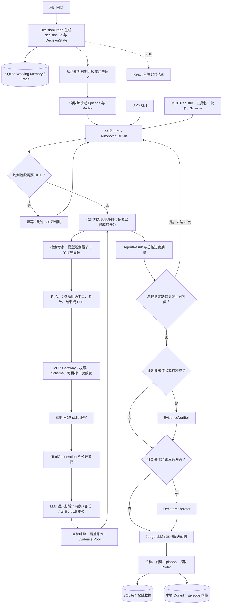

# Personal Decision Agent

## 当前技术栈

- **后端：** Python 3.10+、FastAPI、Pydantic v2、Uvicorn。
- **模型：** OpenAI 兼容 Chat Completions；通过 `response_format={"type":"json_object"}` 和 Pydantic 合同取得结构化输出。
- **Agent 编排：** 项目内实现的可持久化 Plan-and-Execute、增量重规划和专家 ReAct 循环；不使用 LangGraph。
- **工具：** MCP stdio JSON-RPC、运行时工具发现、工具 JSON Schema 子集校验和只读策略。
- **数据：** 本地 SQLite（权威记录、检查点、审计和记忆）与嵌入式 Qdrant `QdrantClient(path="var/qdrant")`（可重建 Episode 向量索引）。
- **前端：** React 18、TypeScript、Vite、Vitest；浏览器使用 HTTP SSE 接收公开 Trace。

这是一个只在本机运行的决策分析系统。它能分析工作 Offer、旅行目的地、产品、投资组合、课程/订阅和通用利弊问题，输出推荐、理由、权衡、风险、置信度与待核验项。它只给建议：不会交易、下单、购买、预订、签约、发送消息、执行 Shell 或修改外部系统。

## 主要能力

- **模型主导规划：** 总控 LLM 读取问题、记忆、8 个 Skill 和已发现 MCP 工具的 Schema，自主输出决策类型、参考 Skill、专家任务、依赖、完成条件、核验/辩论标记和可选 HITL 问题。模型不可用或结构化输出连续失败时才使用本地确定性降级。
- **任务级多 Agent：** 计划可选择 `evidence_research`、`financial_market`、`location_lifestyle`、`preference`、`risk_critic`。前三者才运行 ReAct 和 MCP；偏好专家只读取已传入记忆，风险专家对证据、约束和遗漏做规则式对抗检查。
- **信息目标与 ReAct：** 每个可调用工具的专家先由模型规划最多 5 个信息目标；每个目标独立最多 3 次 MCP 调用。专家依据实际工具名、该工具 Schema、已有工具观察、覆盖账本、可引用证据账本、任务状态和记忆选择调用、结束、HITL 或请求重规划。归纳目标可引用先前已核验资料完成，不必为了结算重复调用工具；额度耗尽后，有可用资料的专家任务会以 `completed_with_gaps` 交给后续保守判断。
- **HITL：** 规划或执行阶段可向用户追问。前端提供最多三个动态字段、自由文本、跳过和 30 秒倒计时自动跳过；同一决策最多两次 HITL。用户填写内容进入当前请求上下文，也作为可追溯画像候选原文。
- **证据与核验：** MCP 传输成功后，LLM 还会依据用户问题、当前目标、完成条件、参数和结果，判定 `relevant`、`partial`、`irrelevant` 或 `unverifiable`。只有相关/部分相关结果才成为带来源、工具、置信度、状态和 `scope_key` 的 Evidence；无关结果保留 Trace，但不污染证据。相同范围资料再交给模型判断支持、补充、矛盾或不确定。
- **四层上下文/记忆：** 每轮模型上下文、可恢复 Working Memory、Episode 和长期 Profile 分开保存。SQLite 是权威来源，Qdrant 只是 Episode 的可重建检索索引。
- **实时可审计 Trace：** 前端逐步显示计划、任务、专家信息目标、工具尝试/重试、观察、核验、重规划、HITL、降级和最终报告。它只展示公开行动摘要和经脱敏 payload，不展示模型私有思维链。



## 目录与推荐读码顺序

```text
main.py               命令行入口与 --check 自检
app/                  配置、服务装配、时间上下文、Trace、FastAPI 路由
models/               跨层 Pydantic 合同与状态枚举
agents/               Planner、Judge、专家、Risk Critic、ReAct 基类
llm/                  全部模型 Prompt、完整 JSON Schema 注入、五次合同修复与确定性降级
graph/                DecisionState、Plan-and-Execute 主循环、条件路由
mcp/                  stdio 客户端、注册表、策略、Gateway、结果归一化
evidence/             Evidence Pool 与 EvidenceVerifier
memory/               SQLite schema/repository、MemoryManager、Qdrant 索引
skills/               8 个领域 Skill 的 front matter 与 Markdown SOP
frontend/             React 页面、SSE 客户端、组件、样式和前端测试
tests/                后端单元、API、流式、记忆、MCP 与验收测试
docs/                 需求、设计和实施资料
var/                  本地 SQLite/Qdrant 数据（Git 忽略）
```

建议顺序：

1. `models/contracts.py`：了解 `DecisionRequest`、`AutonomousPlan`、`TaskSpec`、`ToolObservation`、`Episode` 与状态。
2. `app/container.py`：看服务如何装配，确认 Agent 不直接持有 SQLite 或 MCP SDK。
3. `skills/*/SKILL.md`、`agents/planner.py` 与 `llm/adapter.py`：看模型如何生成并修复结构化计划。
   - **全部生产 Prompt 都集中在 `llm/adapter.py`：** 公共边界在文件开头；总控规划在 `autonomous_plan_or_fallback()`；专家 ReAct 在 `react_or_fallback()`；信息目标计划在 `information_plan_or_fallback()`；工具结果语义核验在 `assess_observation_or_fallback()`；重规划判断在 `replan_decision_or_fallback()`；证据关系核验在 `evidence_relationship_or_fallback()`；工具摘要在 `summarize_tool_result()`；最终裁判在 `judge_or_fallback()`；用户反馈偏好与用户画像抽取分别在 `extract_explicit_profile_signals()`、`extract_user_profile_signals()`。`_structured_with_repair()` 负责为大多数阶段注入完整 JSON Schema 并把校验错误最多反馈模型五次。
4. `graph/decision_graph.py`：看 `decision_id` 生命周期、状态迁移、Plan-and-Execute 主循环、任务账本、跨任务证据账本、增量重规划、核验、裁判和归档。
5. `agents/base.py`：看专家内部的信息目标、逐目标 ReAct 固定上下文、语义观察、跨目标证据引用、覆盖更新、目标结算和额度。
6. `mcp/policy.py` → `mcp/registry.py` → `mcp/gateway.py`：了解工具如何被发现、授权、校验、调用和审计。
7. `memory/database.py` → `memory/repositories.py` → `memory/manager.py` → `memory/vector_index.py`：了解 SQLite 权威数据、删除、Qdrant 派生索引与检索回退。
8. `tests/test_agents.py`、`tests/test_decision_graph.py`、`tests/test_model_adapter.py`：先用关键回归测试对照上述主链路，再按模块阅读其余测试。

## 一次请求怎样流动

```text
POST /decision 或 POST /decision/stream
  -> DecisionGraph.run()/stream() 用 uuid4() 生成一个 decision_id
  -> 新建 DecisionState；保存 RECEIVED Trace 和 SQLite checkpoint
  -> 把原问题写入 profile_source_texts，并把可识别的相对日期写入 temporal_context
  -> MemoryManager.context_for_any()：SQLite 关键词排序，取最多 10 条 Episode 和全部 Profile
  -> Planner / ModelAdapter：依据请求、MemoryContext、Skill 目录、工具目录生成 AutonomousPlan
  -> 若 Planner 请求 HITL：等待提交、跳过或超时；合入用户文本后重新生成计划
  -> 决策类型确定后调用 MemoryManager.context_for()：同类型 Episode 检索 + 同类别 Profile
  -> 记录 Skill、计划与任务账本；按计划列表顺序执行依赖已 completed 或 completed_with_gaps 的普通任务
       -> 检索专家：先建 ExpertInformationPlan，再逐目标 ReAct；每个目标最多 3 次 MCP 调用
       -> 每次成功 MCP 返回先由 LLM 作语义核验；只有 relevant/partial 才进入 Evidence、成功摘要与覆盖更新
       -> ReAct 选择 finish 时必须结算当前目标为 complete/partial/blocked；可引用已核验观察完成比较/归纳；无结算或无有效依据的 complete 会把错误反馈给模型修正
       -> preference：只读取 MemoryContext
       -> risk_critic：检查约束、无证据、未核验、冲突、陈旧与过度宣称
       -> 每任务保存 AgentResult、任务账本、总控进度摘要和 checkpoint
   -> 若有未完成资料：总控先判断缺口是否会实质改变结论且有可执行补救；只有两者均为真、且未达 REPLAN_LIMIT 才生成替代任务
  -> requires_verification 或 Evidence 冲突：进入 EvidenceVerifier
  -> requires_debate 或 Evidence 冲突：进入 DebateModerator
  -> Judge 依据请求、Evidence、MemoryContext、Skill 分析维度和总控上下文生成 DecisionReport
  -> 保存 decision_archives；创建 Episode；从用户原文提取 Profile 信号；尽力 upsert Qdrant
  -> 返回报告、计划、激活专家、Trace 和同一 decision_id
```

### 主链路

Plan-and-Execute 总控 → 专家内部 ReAct → Information Target → MCP → Observation 语义核验 → Target Settlement → Evidence/Findings → 总控摘要 → Replan/Verify → Judge 最终整合 → Memory/Archive

`DecisionGraph._run()` 是整个总工作流的主干，专家执行后还会把结果、覆盖状态、工具观察、Evidence、progress summary 都重新汇总到总状态里。

并且做了以下设计：
- MCP 成功 ≠ 内容可用，还会做 semantic assessment。
- partial 不会被直接丢掉（获得的结果是 partial，也会进入总控的逐步摘要和最后的整合）。
- complete 不允许被后来的 partial 降级。
- 跨目标资料与“直接支持当前目标”的资料做了区分。
- 每个信息 target 有独立 MCP 调用额度。
- completed_with_gaps 可以继续下游综合，同时把缺口公开出来。
- 最终 Judge 不是只看最后一个 Agent，而是拿到 progress summaries、Evidence、coverage、memory 等整体上下文。

整个 Agent 从头到尾的简单逻辑：

```text
用户问题
   ↓
识别决策类型
   ↓
读取相关记忆
   ↓
选择 Skill
   ↓（可选 HITL）
Planner 制定任务 DAG
   ↓
按依赖执行各专家
   ↓
ReAct 专家：
拆目标 → 调 MCP → 检查结果 → 补资料
   ↓
每个专家输出 findings + uncertainties
   ↓
总控逐步汇总
   ↓
必要时 Replan
   ↓
必要时 Evidence Verification / Debate
   ↓
Judge 综合所有资料
   ↓
最终推荐
   ↓
保存轨迹、报告、工作状态和记忆
```

ReAct 专家 Agent 从头到尾的简单逻辑：

```text
收到一个 Task
   ↓
把 Task 拆成若干 Information Target
   ↓
选当前 Target
   ↓
LLM 看当前状态决定下一步
   ↓
call_tool / finish / replan / human input
   ↓
如果 call_tool：
调用 MCP
   ↓
压缩工具结果
   ↓
判断结果是否支持当前 Target
   ↓
有用 → 写 Evidence Ledger
   ↓
Settlement 判断：
继续搜？
还是 complete / partial 结束？
   ↓
未结束 → 再一轮 ReAct
结束 → 下一个 Target
   ↓
所有 Target 完成
   ↓
汇总 findings / uncertainties
   ↓
返回
completed / completed_with_gaps / blocked
```

LLM ReAct 决定下一动作

它可以：

```text
call_tool
finish
request_replan
request_human_input
```

而且会看到非常多公开上下文：

```text
当前任务
当前 target
所有 target
当前任务此前所有调用
成功资料
information coverage
全局 missing info
其他已完成任务
Evidence Ledger
Memory
```

#### 三个 ReAct 专家

三个 ReAct 专家的区别主要只是工具域，真正的执行逻辑都在 BaseReActAgent。PreferenceAgent 和 RiskCritic 虽然继承 BaseReActAgent，但它们重写了 execute()，所以实际并不走这个 ReAct 流程。

EvidenceResearchAgent 负责通用外部事实/网页/地点资料，主要允许：

```text
web_search
fetch_page
place_search
```

LocationLifestyleAgent 主要允许：

```text
web_search
fetch_page
place_search
route_search
weather_forecast
```

负责：

```text
地点
路线
天气
生活方式
```

FinancialMarketAgent 负责金融市场数据，主要允许：

```text
web_search
fetch_page
market_data
```

实际的 ReAct 状态机基本完全相同。

### 阶段 JSON 合同、状态值与去向

以下是当前代码在一次请求中使用的全部关键 JSON 合同。所有模型输出都先经过 Pydantic 校验；模型输出的原始文本和私有思维链不会保存或发送给前端。这里的“传递”指经 `DecisionState` 组装为下一阶段的公开上下文；`working_memories.state_json` 会保存可恢复的状态快照。

#### 1. API 请求：`DecisionRequest`

```json
{
  "query": "必填，用户的问题文本",
  "decision_type": "可选：job_offer | product | travel | portfolio | course_subscription | general",
  "candidates": ["可选，待比较选项"],
  "constraints": ["可选，硬约束"],
  "preferences": ["可选，偏好"],
  "context": {"可选，结构化补充上下文"}
}
```

它是 `POST /decision` 与 `POST /decision/stream` 的输入。图执行器生成 `decision_id`，把该对象放入 `DecisionState.request`；`query`、HITL 与反馈中的用户原文还会进入 `profile_source_texts`、相对日期解析结果和后续 Prompt。初始请求最终会被写入 `decision_archives`、`working_memories` 与 Episode。

#### 2. 总控首次规划/增量规划：`AutonomousPlan`

```json
{
  "decision_type": "job_offer | product | travel | portfolio | course_subscription | general",
  "skill_name": "8 个已发现 Skill 名之一，或 null",
  "planning_summary": "面向用户的公开规划摘要",
  "plan": {
    "goal": "本次分析目标",
    "tasks": [
      {
        "task_id": "唯一任务 ID",
        "objective": "任务目标",
        "agent": "evidence_research | financial_market | location_lifestyle | preference | risk_critic",
        "dependencies": ["必须先 completed 的 task_id"],
        "required_capabilities": ["如 web_search、weather_forecast"],
        "completion_criteria": ["任务完成条件"],
        "status": "pending | running | completed | completed_with_gaps | failed | blocked | skipped"
      }
    ],
    "missing_information": ["仍缺少且可能重要的资料"],
    "requires_verification": false,
    "requires_debate": false,
    "replan_conditions": ["可观察的重规划条件"]
  },
  "hitl_question": "可选，规划阶段需要询问用户时的问题",
  "hitl_rationale": "可选，询问公开原因",
  "hitl_fields": [
    {"key": "字段键", "label": "显示标签", "placeholder": "提示文本", "required": false}
  ]
}
```

这是总控 LLM 的首次输出，也是重规划时复用的同一合同。`task_id` 在一个 `plan.tasks` 内唯一；`dependencies` 只能引用该计划已有任务，不能引用自身。`agent` 只能从当前允许的五个专家中选择；每个任务是否真的可调用工具，还受 MCP 注册表中的 `allowed_agents`、能力和工具 Schema 约束。其 `plan` 会写入 `DecisionState.plan`、任务账本、`plan_created`/`plan_replanned` Trace、SQLite checkpoint 和最终归档的 `decision_archives.plan_json`；`planning_summary` 用于前端公开轨迹。

`status` 这里是计划任务的初始/账本状态；真正的专家结果使用下面的 `AgentResult.completion_status`。`completed` 与 `completed_with_gaps` 都能解除普通下游依赖：后者会连同公开缺口进入综合与最终报告。`blocked`、`failed`、`skipped` 没有可用资料，不能解除依赖。

#### 3. 人工补充：`HITLRequest` 与 `HITLResponse`

总控的上述三个 `hitl_*` 字段，或专家的 ReAct 请求，会由框架生成可向前端展示的对象：

```json
{
  "request_id": "本次追问 ID",
  "decision_id": "所属决策 ID",
  "source_agent": "planner 或发起请求的专家 Agent",
  "stage": "planning | execution | replanning",
  "question": "问题",
  "rationale": "为什么补充它会改善结论",
  "fields": [{"key": "...", "label": "...", "placeholder": "", "required": false}],
  "status": "pending | answered | skipped | timed_out",
  "response_values": {"字段键": "用户填写值"},
  "free_text": "用户自由文本"
}
```

浏览器提交的 `HITLResponse` 是 `{"values": {"字段键":"值"}, "free_text":"...", "skip":false}`。`skip=true` 表示用户明确跳过；30 秒未提交会成为 `timed_out`。请求对象进入 `DecisionState.hitl_requests`、`hitl_requested`/`hitl_resolved` Trace 和 checkpoint；用户填写文本会合并回 `DecisionRequest.context.hitl`、后续模型 Prompt 与画像候选原文，不会直接当成已核验外部事实。

#### 4. 专家任务内部规划：`ExpertInformationPlan` 与 `InformationTarget`

每个运行 ReAct 的专家（`evidence_research`、`financial_market`、`location_lifestyle`）先独立输出：

```json
{
  "targets": [
    {
      "target_id": "唯一、小写且可审计的目标 ID",
      "objective": "要获得的具体信息",
      "completion_criteria": ["什么资料算足够"],
      "status": "pending | partial | complete | blocked",
      "tool_calls_used": 0,
      "latest_summary": null
    }
  ]
}
```

`targets` 至少 1 个、最多 5 个，`target_id` 在任务内唯一；每个目标最多有 3 次 MCP 调用额度。它进入 `DecisionState.information_targets[task_id]`、专家 ReAct 固定上下文、`expert_information_plan` Trace 与 checkpoint。`pending` 是尚未处理，`partial` 是资料相关但未足够，`complete` 是已满足目标，`blocked` 是专家明确保留缺口或额度耗尽。这里的 `complete` 只代表**信息目标**，不代表整个任务或整个决策已完成。

#### 5. 专家每轮选择行动：`ReActDecision`

```json
{
  "action": "call_tool | finish | request_human_input | request_replan",
  "public_summary": "本轮将做什么/依据什么的公开摘要",
  "tool_name": "action=call_tool 时必填，必须是该专家已允许的实际工具名",
  "arguments": {"工具参数，必须符合该 tool_name 的 input_schema"},
  "hitl_question": "action=request_human_input 时必填",
  "hitl_rationale": "action=request_human_input 时必填",
  "hitl_fields": [{"key":"...", "label":"...", "placeholder":"", "required":false}],
  "target_resolution": {
    "target_id": "action=finish 时必须等于当前 target_id",
    "status": "complete | partial | blocked",
    "summary": "当前目标结算摘要",
    "missing_information": ["尚缺资料"],
    "evidence_refs": ["可引用的、已核验 ToolObservation.call_id"],
    "reasoning_basis": "direct_evidence | conservative_inference"
  }
}
```

`call_tool` 只会将已注册、该专家获授权且通过参数 Schema 校验的 `tool_name` 交给 Gateway；其公开选择会形成 `react_action` Trace。`request_human_input` 生成上一节的 HITL；`request_replan` 记录专家公开理由并将缺口交给总控。`finish` 不再能只写“结束”：必须有 `target_resolution`。`evidence_refs` 是同一 `decision_id` 内、已语义核验为 `relevant/partial` 的观察 ID；可引用当前、前一信息目标或上游任务资料。`reasoning_basis=conservative_inference` 表示基于多条已验证资料的公开保守推断。不存在、跨决策或语义不可用的引用会产生公开校验错误并反馈下一轮 ReAct。

ReAct 不输出 `coverage_updates`。`target_resolution` 仅用于专家主动 `finish`、且没有刚产生可用工具观察的比较、归纳或阻塞情形；它结算当前 `InformationTarget.status`。这类结算对象不单独建表，但结果进入状态快照与 `information_target_resolved` / `information_target_status` Trace。

#### 6. 工具观察后的目标结算：`TargetSettlementSubmission`

每次 MCP 工具返回 `succeeded` 且 `ObservationAssessment.relevance` 为 `relevant` 或 `partial` 后，框架立即调用一次专用结算 LLM，不等待下一轮 ReAct。它只接收：当前子目标（不含完成条件）、本次工具名与参数、本次工具结果摘要、语义核验结果、该子目标已有观察与已有覆盖状态；不接收任务、用户问题、记忆或 `completion_criteria`。Prompt 明确允许合理的保守推断，不要求资料绝对精确。

```json
{
  "coverage_updates": [
    {
      "target_key": "必须等于当前 target_id",
      "target": "目标说明",
      "status": "partial | complete",
      "summary": "公开覆盖摘要"
    }
  ],
  "target_resolution": {
    "target_id": "当前 target_id",
    "status": "complete | partial | blocked",
    "summary": "结束摘要",
    "missing_information": ["尚缺资料"],
    "evidence_refs": ["可引用 call_id"],
    "reasoning_basis": "direct_evidence | conservative_inference"
  }
}
```

两个字段都必须出现在 JSON 中：需要继续时写 `coverage_updates`、将 `target_resolution` 设为 `null`；应结束时填写 `target_resolution`。两者同时非空时状态必须一致，否则系统拒绝该次结算。有效覆盖会写入 `DecisionState.information_coverage`；同一 `target_key` 从 partial 更新为 complete 时，旧摘要进入 `history`，新摘要成为 `latest_summary`。目标完成会立刻切换到下一个子目标；`partial` 保留资料并允许后续 ReAct 继续；有结束结算则结束当前子目标。相关 Trace 为 `target_settlement_requested`、`information_coverage_updated`、`information_target_resolved` 与 `target_settlement_applied`。

#### 7. MCP 调用与语义核验：`ToolObservation`、`TraceSummary`、`ObservationAssessment`

Gateway 完成一次调用后先产生：

```json
{
  "call_id": "调用 ID",
  "decision_id": "所属决策 ID",
  "task_id": "所属任务 ID",
  "target_id": "所属信息目标 ID 或 null",
  "agent": "调用专家",
  "tool_name": "实际 MCP 工具名",
  "arguments": {"已校验的调用参数"},
  "status": "succeeded | failed | denied | unavailable | timed_out",
  "semantic_status": "relevant | partial | irrelevant | unverifiable | null",
  "semantic_summary": "LLM 对结果与目标关系的公开说明或 null",
  "semantic_missing_information": ["核验后仍缺的资料"],
  "supports_current_target": true,
  "related_target_ids": ["可选：同一决策中可复用此资料的其他信息目标"],
  "latency_ms": 123,
  "result_summary": "工具返回的公开核心摘要或 null",
  "error": "失败原因或 null",
  "created_at": "UTC ISO-8601 时间"
}
```

其中 `status` 是**传输/策略状态**：`succeeded` 只代表 MCP 正常返回；`failed` 是调用错误；`denied` 是只读策略、权限或参数被拒绝；`unavailable` 是提供方不可用；`timed_out` 是超时。若原始内容超过 1,500 字符，LLM 的 `TraceSummary` 输出 `{"summary":"..."}` 替换公开摘要；模型不可用时才保守截断。

只要 `status=succeeded` 且有结果，LLM 会再输出：

```json
{
  "relevance": "relevant | partial | irrelevant | unverifiable",
  "summary": "为什么结果支撑或不支撑当前信息目标",
  "missing_information": ["仍缺资料"]
}
```

这就是 `ObservationAssessment`，其字段被复制到 `ToolObservation.semantic_*`：

- `relevant`：结果足以支撑当前信息目标；
- `partial`：结果相关但范围、时间、对象或细节不完整；
- `irrelevant`：结果与当前目标完全无关，且无法从中作任何合理推断；资料虽不完整、范围不全或只能支持保守判断时应为 `partial`；
- `unverifiable`：结果内容不足，或语义核验模型不可用，不能安全判断。

`supports_current_target=true` 才能使结果进入当前目标的成功摘要、覆盖更新和 Evidence。若资料不直接支持当前目标、但支持同一决策另一个已知目标，LLM 可返回 `partial + supports_current_target=false + related_target_ids`：它不会误完成当前目标，但会进入可引用证据账本，供后续目标按 `call_id` 结算。`irrelevant`、`unverifiable` 仍在 `DecisionState.tool_observations`、checkpoint 和 `tool_observation` Trace 中可见，也占用该信息目标的调用额度，但不会伪装成证据。

#### 7. 证据与关系：`Evidence`、`EvidenceRelationship`

通过语义核验的观察转为 `Evidence`：

```json
{
  "evidence_id": "EV-...",
  "decision_id": "所属决策 ID",
  "claim": "由信息目标或任务得到的主张",
  "scope_key": "任务|目标|工具|规范化参数范围",
  "value": "公开结果摘要",
  "source": "mcp:工具名",
  "source_type": "external_tool",
  "agent": "产生它的专家",
  "tool": "工具名",
  "confidence": 0.0,
  "freshness": null,
  "status": "pending | confirmed | unverified | conflicting | rejected | unavailable",
  "supports": ["其他 evidence_id"],
  "contradicts": ["其他 evidence_id"],
  "retrieved_at": "UTC ISO-8601 时间"
}
```

它保存到 SQLite `evidence`，进入 `EvidencePool`、总控/裁判 Prompt 和最终报告的事实来源。`scope_key` 相同的两条资料才交给 LLM 输出 `EvidenceRelationship`：`{"relation":"supports | complements | contradicts | uncertain", "summary":"公开关系说明"}`。`supports` 表示支持，`complements` 表示互补，`contradicts` 表示同一事实无法同时成立，`uncertain` 表示不能确定；关系会更新 Evidence 的状态/关联并产生 `evidence_relationship_assessed` Trace。

#### 8. 专家任务结束：`AgentResult` 与总控进度摘要

```json
{
  "result_id": "结果 ID",
  "decision_id": "所属决策 ID",
  "task_id": "所属任务 ID",
  "agent_name": "专家名",
  "summary": "公开任务摘要",
  "evidence_ids": ["关联证据 ID"],
  "findings": ["通过语义核验的发现"],
  "uncertainties": ["失败、无关、无法核验或未覆盖项"],
  "tool_calls_used": 0,
  "completion_status": "pending | running | completed | completed_with_gaps | failed | blocked | skipped",
  "created_at": "UTC ISO-8601 时间"
}
```

它保存到 SQLite `agent_results`、任务账本、`DecisionState.agent_results`、`agent_task_completed` Trace 和 checkpoint。`completed` 代表资料充分完成；`completed_with_gaps` 代表已有可用资料、但仍保留普通缺口，二者都可解除**普通** DAG 依赖并进入下游综合；`blocked` 表示没有可用资料或无法完成，不能解除依赖；其余状态分别表示未开始、运行中、失败、跳过。每个任务结束后框架还生成并保存/展示 `controller_progress_summary`：`{"用户问题":..., "为完成这一问题计划的全部任务有":[...], "目前已完成的任务有":[...], "目前得到的信息":[...], "仍缺少或存在冲突的信息":[...], "下一步应该做":...}`；它会进入之后的专家、重规划和裁判上下文。

#### 9. 总控是否重规划：`ReplanDecision`

```json
{
  "should_replan": true,
  "reason": "公开的重规划理由",
  "critical_gaps": ["可能改变推荐、硬约束或关键风险的缺口"],
  "can_execute_remedy": true
}
```

这是执行完当前计划后总控 LLM 的结构化判断，而不是“只要有不确定性就重规划”的规则。只有 `should_replan=true`、`critical_gaps` 非空且 `can_execute_remedy=true` 才进入重规划；否则普通缺口留给核验和最终报告。它读取任务账本、目标结算、语义无关/失败观察、Evidence、覆盖状态和总控进度摘要，临时保存于 `DecisionState.replan_decision`、checkpoint 及 `REPLANNING` 状态 Trace。若要重规划，总控再输出第 2 节的增量 `AutonomousPlan`，框架防御性移除已完成任务。

#### 10. 裁判、归档、画像与前端 Trace：`DecisionReport`、`WorkflowEvent`、`DecisionResponse`

裁判 LLM 输出最终 `DecisionReport`：

```json
{
  "recommended_option": "推荐项",
  "confidence": 0.0,
  "confirmed_facts": ["已确认事实"],
  "external_views": ["外部资料观点"],
  "inferences": ["明确标注为推断的内容"],
  "preference_matches": ["与用户偏好的匹配"],
  "uncertainties": ["未核验或资料不足"],
  "rejected_options": ["不推荐选项"],
  "tradeoffs": ["取舍"],
  "risks": ["风险"],
  "next_verification_steps": ["建议用户继续核验的步骤"],
  "analysis_mode": "model | deterministic_fallback",
  "fallback_reason": "降级原因或 null"
}
```

`analysis_mode=model` 表示模型生成；`deterministic_fallback` 表示模型不可用或连续五次合同修复失败后由本地保守规则生成。报告写入 `DecisionState.report`、`decision_archives.report_json`，并由 API 返回；模型推荐、理由、取舍、风险和不确定性不会自动写进 Episode。

每一个可展示阶段统一为 `WorkflowEvent`：

```json
{
  "event_id": "事件 ID",
  "decision_id": "所属决策 ID",
  "from_state": "上一 WorkflowStatus 或 null",
  "to_state": "received | classified | memory_retrieved | skill_loaded | planned | executing | waiting_for_input | replanning | verifying | debating | judging | completed | archived | failed",
  "kind": "事件类型，如 plan_created、react_action、tool_observation、information_target_resolved、agent_task_completed、controller_progress_summary、final_report",
  "title": "前端标题",
  "summary": "公开摘要",
  "sequence": 0,
  "payload": {"该事件的结构化细节"},
  "created_at": "UTC ISO-8601 时间"
}
```

它保存到 SQLite `workflow_events`，并通过 SSE 逐步发送给前端。最终 API 响应为 `DecisionResponse`：`{"decision_id":"...", "decision_type":"...", "status":"...", "report":{...}|null, "plan":{...}|null, "events":[...], "activated_agents":[...], "candidates":[...]}`。归档后，框架还创建 Episode，并让 LLM 从**用户亲自输入**的初始问题、HITL、反馈理由输出 `ProfileSignalExtraction`：`{"signals":["explicit:..."]}`；这些信号再按三层记忆规则更新 SQLite Episode/Profile 和可重建的 Qdrant Episode 索引。

`POST /decision/stream` 会先返回 `decision_started` 事件，随后持续推送事件。浏览器断开只会断开 SSE 读取，后台任务仍会继续；归档成功后可通过 `GET /decision/{decision_id}` 读取报告和持久化 Trace。

`POST /decision/{decision_id}/continue` 会从 `working_memories.state_json` 读取旧状态，复用 `decision_id`，把“继续说明”和额外 context 合进请求，然后重新创建当前运行的状态、重新规划并执行；它不是从原任务循环的精确位置继续。

## 传输协议与 Trace

- **MCP：stdio JSON-RPC。** Gateway 为每个配置启动本地子进程，经标准输入/输出执行 `initialize`、`tools/list`、`tools/call`。它是后端到本地 MCP 的协议，不是浏览器接口。
- **前端 Trace：HTTP SSE。** 浏览器用 `fetch` POST 到 `/decision/stream`，读取 `text/event-stream` 帧。事件带 `sequence`、`kind`、中文标题、摘要和 payload。

长工具结果或错误超过 1,500 字符时，模型会按用户问题、任务和工具名提炼公开摘要；模型不可用或摘要合同失败时才保留脱敏后的前 1,500 字符。脱敏只遮蔽明确的凭据字段，例如 `api_key`、`token`、`secret`、`authorization`、`password` 及对应后缀；`target_key`、任务 ID 等普通业务字段会保留。

## 自主规划、重规划与 HITL

总控输出 `AutonomousPlan`。Prompt 包含完整 JSON Schema、字段合同、6 个决策类型、8 个 Skill、允许专家及每名专家当前可用的工具/Schema。模型必须只返回 JSON；Pydantic 校验失败时会收到上次错误和无效输出，最多修复 5 次。专家 ReAct、信息目标计划、裁判和证据关系判断也使用相同的“Schema + 最多五次修复”模式。结构化修复预算不占 MCP、重规划或 HITL 次数。

每轮 ReAct 的 `execution_context.react_context` 包含：用户问题、全部任务、已完成任务、当前任务、当前信息目标、信息目标计划、任务完成条件、当前任务历史工具调用、成功摘要、跨任务成功信息、跨重规划覆盖状态、覆盖账本、**可引用证据账本（含 call_id）**、任务状态账本、待关注缺口、上一轮指令及结果、MemoryContext 和 HITL 补充。旧失败详情不反复注入；只有上一轮失败才单独提供失败原因。

每次 MCP 返回 `succeeded` 后，`ObservationAssessment` 由 LLM 基于完整语境判定内容与当前目标的关系；这不是关键词匹配或简单规则。`irrelevant` 仅用于完全无关且无法合理推断的结果；相关但不完整的资料应为 `partial`。若它仅服务同一决策的另一已知目标，则标记 `supports_current_target=false` 并保留 `related_target_ids`，而不是污染当前目标。`irrelevant`/`unverifiable` 会保留工具调用和核验摘要，计入额度，却不会写入 Evidence、成功摘要、跨任务成功上下文或覆盖更新。`relevant`/`partial` 则立即进入专用目标结算 LLM，由它更新资料覆盖或结束结算；专家 ReAct 不再生成 `coverage_updates`。专家主动选择 `finish` 时仍必须提交当前目标的 `TargetResolution`（状态、摘要、缺口、`evidence_refs` 和推断依据），用于没有刚产生可用工具观察的比较、归纳或阻塞情形。纯比较/归纳目标可以引用证据账本中的已核验观察而结算为 complete，无需重复工具调用。complete 后立即切换下一个目标；partial/blocked 会保留现有资料与缺口。若专家已有可用资料但有普通缺口，其任务状态为 `completed_with_gaps`，可作为普通下游综合的依赖，并由总控决定是否重规划。

重规划上限为 `REPLAN_LIMIT`（默认 3）。出现未完成资料时，`ReplanDecision` 由总控 LLM 结构化判断：只有缺口可能实质改变推荐、硬约束或关键风险，且允许专家/工具可执行补救，才会重规划。它收到任务账本、目标结算、语义无关/失败观察、Evidence 与覆盖状态；计划只应包含尚未满足的任务。模型不可用时采用保守降级：保留缺口并进入核验或最终判断，不会因任意 `uncertainties` 自动循环。执行器仍会防御性移除已完成任务与其依赖。

HITL 请求由 `hitl_requested` Trace 事件携带。页面在该事件下显示表单与倒计时；提交调用 `POST /decision/{id}/hitl/{request_id}`，跳过或超时也会恢复流程。填写内容只进入当前状态的 `request.context.hitl`、画像候选原文和之后的模型输入。

系统会以 `Asia/Shanghai` 当前日期解析“今天、明天、后天、这周末/本周末、下周末、本周几、下周几”。它保留原始表达；不能明确解析时不猜测日期。

## 多 Agent 与 Harness

| Agent | 当前实现 | MCP 能力 |
|---|---|---|
| `evidence_research` | 运行 ReAct，收集通用外部事实 | `web_search`、`fetch_page`、`place_search` |
| `financial_market` | 运行 ReAct，收集金融/市场资料 | `web_search`、`fetch_page`、`market_data` |
| `location_lifestyle` | 运行 ReAct，收集地点、路线、天气资料 | `web_search`、`fetch_page`、`place_search`、`route_search`、`weather_forecast` |
| `preference` | 只读已传入的长期 Profile | 无 |
| `risk_critic` | 规则式风险、证据缺口与约束审查 | 无 |
| `judge` | 汇总模型报告或本地降级报告 | 无 |
| `debate_moderator` | 以 Evidence ID 组织正反结论 | 无 |

Skill 不是关键词触发器。它提供推荐专家、工具、分析维度、工作流、风险检查和完成条件，供 Planner 参考。实际决策类型来自总控 `AutonomousPlan`，或模型不可用时的 `DeterministicReasoner` 保守计划。

所谓 harness 是对模型自主性施加的运行时边界，而不是提示词承诺：Pydantic 合同、五次结构化修复、已发现工具白名单、Agent 能力授权、工具 Schema 校验、只读/禁止动作策略、每信息目标三次额度、同工具同参数失败后的重复阻止、HITL、重规划上限、SQLite checkpoint、Evidence/Trace 审计和明确降级。

Gateway 只注册可映射为 `web_search`、`fetch_page`、`place_search`、`route_search`、`weather_forecast`、`market_data` 的只读工具。它拒绝写入型工具和参数中的执行、Shell、安装、删除、交易、购买、预订、提交、接受等动作；`tavily_research`、图片、视频、上下文拼装工具也不会暴露给 Agent。网关调用前检查工具自身 Schema；失败会成为 `ToolObservation`，不会伪装成 Evidence。一次已选择工具的底层 MCP 调用失败/超时会自动重试一次。

## Skills

`SkillRegistry` 扫描 `skills/<folder>/SKILL.md`。Skill 文件必须具有以 `---` 包围的 YAML front matter、非空 Markdown 正文，且必须有：`name`、`description`、`recommended_agents`、`recommended_tools`、`analysis_dimensions`、`workflow`、`risk_checks`、`completion_conditions`、`output_schema`。`name` 必须与目录名一致，并且只包含小写字母、数字和连字符。

内置 Skill：

- `job-offer-evaluator`：工作 Offer 的薪酬、成长、公司、地点和风险比较。
- `product-comparison`：产品规格、总成本、适配度与缺点比较。
- `travel-destination-compare`：目的地天气、路线、预算、景点和节奏比较。
- `portfolio-review`：资产配置、集中度、风险和流动性分析。
- `course-subscription-evaluator`：课程/订阅的费用、时间投入和使用概率评估。
- `risk-debate-moderator`：正反依据、硬约束、不可逆风险和未决问题审查。
- `evidence-verification`：证据来源、时效性、冲突与二次核验建议。
- `decision-retrospective`：基于用户反馈的决策复盘。

## 记忆、上下文与删除

### 四层内容的来源与作用

| 层级 | 保存内容 | 来源与用途 |
|---|---|---|
| 模型上下文 | ReAct 固定任务视图、覆盖账本、任务账本、工具观察、总控进度摘要、MemoryContext、HITL | 每轮由 `DecisionState` 重建；只用于当前模型调用，不保存私有思维链 |
| Working Memory | `DecisionState`：请求、计划、任务/目标状态、观察、Evidence、AgentResult、HITL、报告、checkpoint 等 | SQLite `working_memories`，用于故障后读取和 `/continue` 的原请求恢复；不用于未来相似度检索 |
| Episode | 初始归档：问题、候选项、约束、偏好、标签、画像信号；反馈后可补用户选择、反馈、选择/不选择理由、结果 | SQLite `episodes`；后续相似问题的经验检索。初始归档不会把模型推荐、推荐理由、权衡、风险和不确定性写入 Episode |
| Profile | 画像/稳定偏好、重要性、置信度、来源 Episode ID | LLM 仅从用户亲自输入的初始问题、HITL 和反馈理由抽取显式信号；用户选项会形成推断信号。显式信号立即写入；同一推断需至少两个不同 Episode 一致才建立/强化，冲突降低置信度 |

画像提取失败、模型不可用或用户原文未提供画像时，系统不编造 Profile。年龄会按上海参考日期转换为保守出生年份范围；例如 2026 年“25 岁”可成为 `2000-2001`，不会伪造精确生日。

### Episode 检索

初始规划使用 `context_for_any()`：SQLite 按问题摘要 token 重叠和时间排序，跨领域取最多 10 条 Episode，并提供全部 Profile。决策类型确定后，`context_for()` 查询该领域 Episode：Qdrant 可用时先以 128 维本地确定性哈希向量进行 Cosine 检索（最多 10 个 point ID），再由 SQLite 读取权威原文并用 SQLite 排名补足；Qdrant 不可用时完全回退 SQLite 的摘要、标签和时间衰减排序。此后的 `MemoryContext` 只保留 `category == decision_type` 的 Profile；因此初始问题/HITL 抽出的 `explicit:user_profile:*` 画像目前保证进入总控首次规划，但不会自动进入类型确定后的专家与裁判上下文，除非其类别正好等于该决策类型。反馈理由还会产生该决策类型类别的显式偏好，后续同类专家与裁判可以读取它。

Qdrant 只有 `episodes` collection：point ID 是 `episode_id`，payload 为 `decision_id`、`decision_type`、`tags`、`created_at`；不保存聊天原文。它是派生索引，删除或重建索引目录不会删除 SQLite Episode。

### 会话与删除语义

前端对话历史位于浏览器 `localStorage`（键为 `personal-decision-agent.conversations.v1`），保存消息、Trace、标题、候选项和关联 `decision_id`。它不等同于后端一次决策：一个前端会话可含多次 `decision_id`。

删除弹窗会收集该前端会话的全部 `decision_id` 后调用 `POST /decisions/delete`：

- **仅删除聊天历史：** 后端会删除 `decision_archives`、`working_memories`、`evidence`、`agent_results`、`tool_calls`、`workflow_events`、`feedback`、`retrospectives` 中这些 ID 的记录；Episode/Profile/Qdrant 不删。
- **删除聊天历史及关联记忆：** 除上述记录外，还删除对应 Episode；仅当 Profile 的所有 `source_episode_ids` 都被删除时才删 Profile，否则保留 Profile 并移除这些来源 ID；随后尽力删除对应 Qdrant point。

SQLite 删除在一个事务中完成。Qdrant 删除失败不会回滚 SQLite，可能留下无法再由 SQLite 读取的孤立向量。另一个当前实现边界是：前端删除请求失败时仍会删除浏览器本地会话；因此不能把前端消失视为后端一定已清空。

## SQLite：每张表与列

默认数据库为 `var/personal_decision.db`。初始化会保留旧数据，并按需增加 `workflow_events` 的 Trace 列、`episodes` 的反馈列、`evidence.scope_key` 与 `tool_calls.target_id`。

| 表 | 列 |
|---|---|
| `decision_archives` | `decision_id`、`decision_type`、`query`、`status`、`candidates_json`、`constraints_json`、`preferences_json`、`plan_json`、`report_json`、`recommendation`、`confidence`、`created_at`、`updated_at` |
| `working_memories` | `decision_id`、`state_json`、`checkpoint_version`、`updated_at` |
| `episodes` | `episode_id`、`decision_id`、`decision_type`、`summary`、`options_json`、`recommendation`、`user_choice`、`key_reasons_json`、`tradeoffs_json`、`outcome`、`feedback`、`chosen_reason`、`not_chosen_reason`、`constraints_json`、`preferences_json`、`tags_json`、`profile_signals_json`、`created_at` |
| `profile_memories` | `id`、`category`、`memory_key`、`value_json`、`importance`、`confidence`、`source_episode_ids_json`、`created_at`、`updated_at` |
| `evidence` | `evidence_id`、`decision_id`、`claim`、`scope_key`、`value_json`、`source`、`source_type`、`agent`、`tool`、`confidence`、`freshness`、`status`、`supports_json`、`contradicts_json`、`retrieved_at` |
| `agent_results` | `id`、`decision_id`、`task_id`、`agent_name`、`result_json`、`completion_status`、`created_at` |
| `tool_calls` | `call_id`、`decision_id`、`task_id`、`target_id`、`agent_name`、`tool_name`、`arguments_json`、`status`、`latency_ms`、`result_summary`、`error`、`created_at` |
| `workflow_events` | `id`、`decision_id`、`from_state`、`to_state`、`kind`、`title`、`summary`、`sequence`、`payload_json`、`created_at` |
| `feedback` | `id`、`decision_id`、`user_choice`、`outcome`、`notes`、`created_at` |
| `retrospectives` | `id`、`decision_id`、`result_json`、`created_at` |

所有 `*_json` 列保存 JSON；时间以带时区 ISO 8601 字符串保存。

## Windows PowerShell 安装与配置

在项目根目录执行。项目依赖声明支持 Python 3.10+；建议使用一个与已安装依赖一致的 Python 版本。

```powershell
py -3.10 -m venv .venv
.\.venv\Scripts\Activate.ps1
python -m pip install --upgrade pip
python -m pip install -r requirements.txt
Copy-Item .env.example .env
```

若 PowerShell 不允许激活：

```powershell
Set-ExecutionPolicy -Scope Process -ExecutionPolicy Bypass
.\.venv\Scripts\Activate.ps1
```

`.env` 由 `app/config.py` 加载。`.env.example` 的当前完整配置为：

```dotenv
LLM_MODEL_ID=
LLM_API_KEY=
LLM_BASE_URL=
SQLITE_PATH=var/personal_decision.db
QDRANT_PATH=var/qdrant
MCP_COMMANDS_JSON=[]
REQUEST_TIMEOUT_SECONDS=60
TOOL_TIMEOUT_SECONDS=60
REACT_CALL_LIMIT=3
REPLAN_LIMIT=3
HITL_TIMEOUT_SECONDS=30
HITL_REQUEST_LIMIT=2
```

设置 `LLM_MODEL_ID` 与 `LLM_API_KEY` 后，`LLM_BASE_URL` 可指向 OpenAI 兼容接口。三者缺失或调用异常时会产生确定性降级；若设置超时字段，配置值会覆盖代码默认值（请求 30 秒、工具 20 秒）。

## 本地 MCP（stdio JSON-RPC，不用 Docker）

MCP 服务以子进程形式由后端自动启动；不要在另一个窗口长期手工运行它们。手工执行 `uvx ...` 或 `npx ...` 后看起来“卡住”通常是正常的：服务正在等待 JSON-RPC 输入。

Fetch 示例：

```powershell
winget install --id=astral-sh.uv -e
uvx mcp-server-fetch --help
```

Tavily 示例（项目只允许它的 `tavily_search`，不允许 `tavily_research`）：

```powershell
winget install OpenJS.NodeJS.LTS
$env:TAVILY_API_KEY = 'replace-me'
npx -y tavily-mcp@latest
```

把真正命令写入项目根目录的 `.env`。Windows 上 `npx` 建议经 `cmd /c` 调用：

```dotenv
MCP_COMMANDS_JSON=[{"name":"fetch","command":"uvx","args":["mcp-server-fetch"],"env":{"PYTHONIOENCODING":"utf-8"}},{"name":"tavily","command":"cmd","args":["/c","npx","-y","tavily-mcp@latest"],"env":{"TAVILY_API_KEY":"replace-me"}}]
```

可加入任意可信、只读的天气、地图、路线或市场 stdio MCP。是否可被使用取决于该服务实际 `tools/list` 返回的名称、描述和 JSON Schema；启动 `--check` 后的 capability 列表才是本机最终可用能力。Tavily 需要 API key；Fetch 本身不需要。其他服务是否需要 key 由其自身提供方决定，项目不内置天气、地图或市场服务的 key。

## 启动、自检、后端与前端

### 后端

`--check` 初始化 SQLite、加载 Skill、发现并关闭已配置 MCP，不启动 HTTP 服务：

```powershell
python main.py --check
```

当前 Vite 开发代理固定指向 `http://127.0.0.1:8080`，因此按默认前端配置启动后端时请使用 8080：

```powershell
python main.py --host 127.0.0.1 --port 8080
```

单独使用后端时，端口可以自行指定；`main.py` 默认 8000，等价 Uvicorn 命令为：

```powershell
python -m uvicorn app.main:app --host 127.0.0.1 --port 8080
```

### 前端

另开一个 PowerShell，在项目根目录执行：

```powershell
cd frontend
npm install
npm run dev
```

Vite 会显示浏览器地址（通常为 `http://localhost:5173`）。开发模式不需要 `npm run build`，Vite 会热更新；首次或依赖变化后需要 `npm install`。`frontend/vite.config.ts` 把 `/api/*` 代理到 `http://127.0.0.1:8080/*`，因此无需新增前端 `.env`。

当前 `VITE_API_BASE_URL` 的代码行为是把它拼成 `<VITE_API_BASE_URL>/api/decision`。若设置该变量，目标服务必须提供 `/api` 反向代理前缀；直接暴露本项目 FastAPI 时，开发模式使用 Vite 代理更合适。

生产静态构建命令为：

```powershell
npm run build
```

### 测试

```powershell
python -m pytest -q
python -m pytest tests\test_acceptance.py -v
cd frontend
npm run test
```

后端测试使用假模型/假 MCP 或降级逻辑；不要求真实网络和真实凭据。

## API

`POST /decision`、`POST /decision/stream` 都接受：

```json
{
  "query": "上海工作与杭州 AI Offer 怎么选",
  "candidates": ["上海工作", "杭州 Offer"],
  "constraints": ["薪资不能低于当前水平"],
  "preferences": ["重视职业成长和通勤"],
  "context": {}
}
```

除 `query` 外字段都有默认值，前端当前只发送 `query`。后端不会自动把历史数据库内容填到 `candidates`、`constraints` 或 `preferences`；历史 Profile/Episode 会作为 `MemoryContext` 供模型参考。

PowerShell 示例：

```powershell
$body = @{ query = '上海工作与杭州 AI Offer 怎么选' } | ConvertTo-Json
Invoke-RestMethod -Method Post `
  -Uri 'http://127.0.0.1:8080/decision' `
  -ContentType 'application/json' `
  -Body $body | ConvertTo-Json -Depth 12
```

`Invoke-RestMethod` 是在 PowerShell 中发 HTTP POST；反引号表示命令换行，`ConvertTo-Json -Depth 12` 将响应对象完整打印为 JSON。

完整路由：

- `POST /decision`
- `POST /decision/stream`
- `POST /decision/{decision_id}/hitl/{request_id}`
- `POST /decision/{decision_id}/continue`
- `GET /decision/{decision_id}`
- `GET /decisions`
- `POST /decisions/delete`
- `POST /decision/{decision_id}/feedback`
- `POST /decision/{decision_id}/retrospective`
- `GET /memory/profile`
- `GET /memory/episodes`
- `GET /skills`
- `GET /mcp/tools`

未知决策 ID 通常返回 404；请求合同不通过时 FastAPI/Pydantic 返回 422。

## 离线降级

模型未配置、模型请求超时/报错、模型 JSON 输出五次都未通过 Pydantic 合同，或部分模型辅助操作失败时，系统记录 `deterministic_fallback` 事件并使用 `DeterministicReasoner` 的保守计划、ReAct 动作或报告。无模型时检索专家不会猜测工具名或参数；无 MCP 或 MCP 出错时会得到 typed `unavailable`、`failed`、`timed_out` 或 `denied` 观察。报告会保留不确定性，确定性报告置信度上限为 0.45，不把缺失外部资料写成实时事实。

## 遇到的问题和解决

1. **短期记忆看起来没有规划：** 直接把完整状态塞入 Prompt 不利于模型判断。现在从 `DecisionState` 重建固定任务上下文，并在每个任务结束时保存总控进度摘要。
2. **专家可能死磕精确资料：** Prompt 明确允许依据已有足够资料或合理推断结束；每个信息目标有独立调用上限，超过上限会阻塞并保留已有结果。
3. **目标标记完成后仍可能调用旧目标：** 执行框架在应用 `coverage_updates` 后先检查 `complete`，立即停止该目标。
4. **`target_key` 被过宽脱敏：** 脱敏规则已改为精确凭据字段或凭据后缀，保留目标键以便前端正确显示状态。
5. **`blocked` 任务曾被当作依赖已完成：** 现在 `blocked`、`failed`、`skipped` 均不能解锁下游；而已有可用资料但仍存在普通缺口的任务会使用 `completed_with_gaps`，与 `completed` 一样可解除普通依赖、把资料交给下游综合，同时保留不确定性供总控判断是否需要重规划。
6. **互补证据被误判矛盾：** 证据按任务、目标、工具和参数建立 `scope_key`；同范围不同资料由模型关系判别，模型不可用时保守保持 `uncertain`，不自动制造冲突。
7. **MCP 调用成功却拿到无关内容：** 过去只要 stdio/HTTP 返回正常，诸如“南京景点”任务得到“北京景点”页面也会被记为成功 Evidence、占用成功额度并误导后续任务。现在调用后使用 LLM 的 `ObservationAssessment` 做语义核验；无关或无法核验的内容仍可审计，但不会成为证据或成功上下文。
8. **专家 finish 未结算目标，引发重复重规划：** 过去专家直接 finish 而没有 `complete` 覆盖更新时，框架会把目标改为 blocked；路由又把任意不确定性当作重规划条件，造成重复的综合任务。现在 finish 必须提交 `TargetResolution`，不合法或缺少相关依据会反馈给模型修正；重规划由总控 `ReplanDecision` 判断“是否关键且可补救”，普通缺口直接保留为最终不确定性。
9. **比较/归纳目标没有自己的工具调用而被阻塞：** 过去框架只承认当前目标的本地观察；例如已分别获得两项资料后，“比较两者”这一目标没有必要再调用工具，却会因没有本地观察而无法完成。现在语义核验通过的资料会进入同一 `decision_id` 的可引用证据账本，专家可在 `TargetResolution.evidence_refs` 指向这些 `call_id`，并以 `conservative_inference` 完成比较或归纳目标。
10. **有可用资料却因普通缺口阻塞整个下游：** 过去一个专家在额度耗尽前已得到部分可靠资料，任务仍会被统一标成 `blocked`，导致后续综合任务无法使用它。现在框架区分“完全缺乏可用资料”的 `blocked` 与“可继续综合、但有缺口”的 `completed_with_gaps`；后者的已核验发现、缺口和证据都会传给总控、核验器、裁判与前端 Trace。
11. **专家 ReAct 可能漏写关键结算字段：** 过去工具结果已语义核验为 `relevant` 或 `partial` 后，仍依赖下一轮 ReAct 主动输出 `coverage_updates` 或 `target_resolution`，目标可能因此漂移。现在把结算从 ReAct 中拆出：每条语义可用观察都会立即进入专用结算 LLM，注入专用 JSON Schema、当前子目标、工具调用与结果、语义核验、已有观察和覆盖状态；它不接收完成条件，并允许保守推断。系统立刻校验并写入当前目标；无效输出只保留观察和失败 Trace，不伪造完成状态。


**问题：** 当前 ReAct 专家的短期工作记忆如果主要按“上一轮调用了什么工具、返回了什么 Observation”的流水账方式组织，模型虽然看到了历史，却没有形成清晰的“任务状态认知”，因此容易出现重复搜索、误判缺口和被失败记录持续干扰的问题。结合当前实现，一个 `task` 会被拆成多个 information target，模型实际上需要持续知道“总 task 要完成什么、当前有哪些 target、当前正在处理哪一个、前面的 target 是否已经 complete/partial、每个已完成 target 的结论是什么及依据哪些有效 Observation 得出、当前 target 已经获得了哪些有效证据、还缺哪些 completion criteria、下一步究竟应该补什么”，而不是反复读取完整工具调用历史。例如三个 target 中前两个已经搜完，当前执行第二个或第三个时，如果上下文只是罗列此前 Observation，模型很容易看到“还没有最后一个 target 的信息”，便错误地把它当成**当前 target 的证据不足**，从而继续重复搜索已经完成的当前内容；同样，工具调用失败、返回失败或语义不相关的结果如果长期保留在滚动上下文中，模型会不断把历史失败当成最近仍在发生的问题，进入过度防御状态，反复换关键词、规避工具或重新验证已经解决的问题。**解决方式：** 将短期工作记忆从“事件流水账”改造成“结构化任务状态 + 极短近期事件”的上下文工程：为 ReAct 每一轮显式提供 `task objective → target plan → current target → 已完成 target 摘要 → current target 当前覆盖状态 → 已获得的有效证据及来源 → completion_criteria 逐项满足情况 → missing_information → 当前下一步目标`，其中已完成 target 只保留压缩后的最终状态和结论，不再反复暴露其全部搜索过程；当前 target 的成功 Observation 才持续累积进入工作记忆，并由 Settlement 不断更新“已满足什么、还缺什么”，使模型下一轮直接围绕缺口行动，而不是自行从历史记录重新推断进度。失败信息则采用**短生命周期机制**：某次调用失败、无结果或不相关时，只在紧接着的下一轮提供完整失败详情和拒绝原因，帮助 ReAct 修正动作；之后删除原始失败结果，只在一个简短的 `avoid/retry_notes` 中保留抽象经验，例如“上一查询过窄，无有效结果”“city=Nanjing 与当前苏州 target 不匹配”“该工具本 target 已失败一次”，避免失败内容长期污染推理。与此同时，必须把“全局任务缺口”和“当前 target 缺口”严格分离：其他尚未执行 target 缺信息是正常状态，不能作为当前 target 未完成的依据；ReAct 只依据当前 target 的 `completion_criteria + accumulated evidence + missing_information` 决定是否继续搜索，当前 target 一旦 complete 或额度耗尽后结算为 partial/blocked，就单向进入下一个 target，不再因为看到后续 target 尚未完成而回头重复搜索。这样工作记忆实际上不再回答“之前发生过什么”，而主要回答四件事：**整个任务要做什么、现在做到哪里、已经确认了什么、当前还缺什么**，工具调用历史只作为辅助证据来源存在。


## Agent 测评与未来完善

可建立固定题集：为每题保存期望任务/Trace 行为、允许工具范围、证据覆盖标准、最终报告评分规则；每次改动模型、Prompt、MCP、记忆或工作流后比较任务完成率、工具成功率、重复率、重规划次数、HITL 触发质量、证据覆盖、置信度校准和不确定性标注。

后续可完善：严格拓扑排序和依赖环检测、基于候选项/日期/维度的完成条件验证、来源 URL/域名级证据独立性、工具成本/成功率进入规划、前端 Profile 浏览修正与删除、删除请求失败的用户可见提示，以及版本化评测数据和回归报告。
